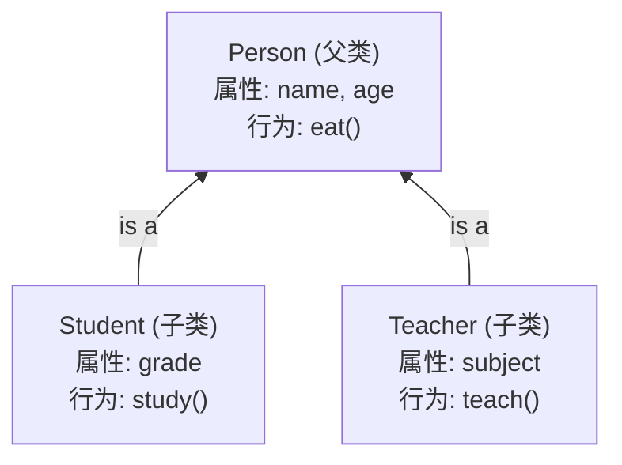
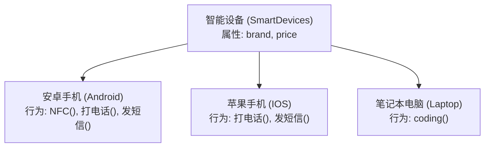
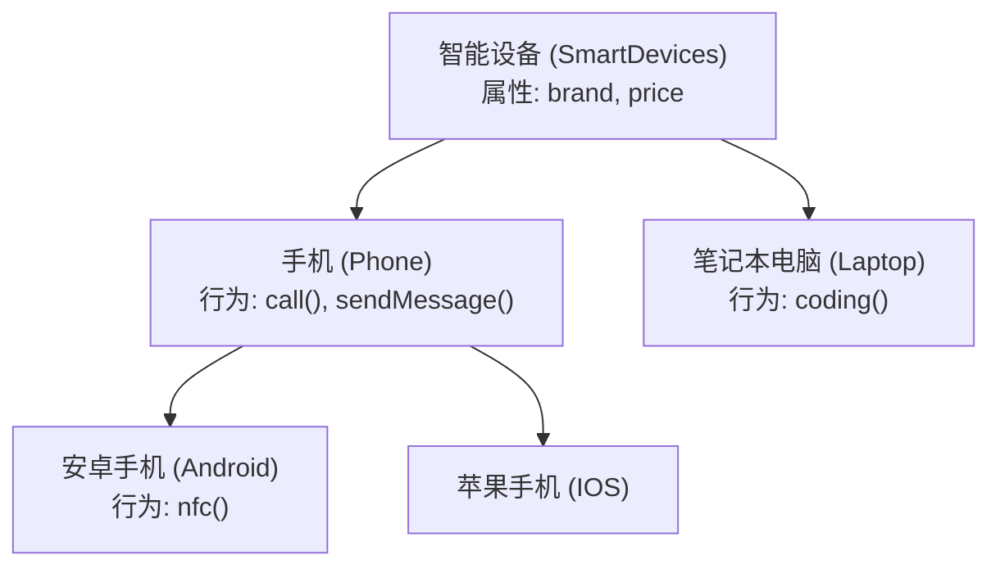
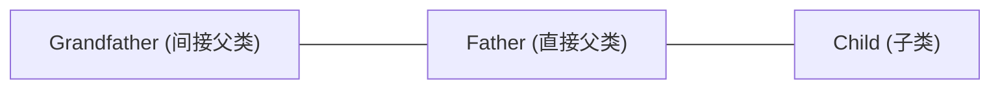
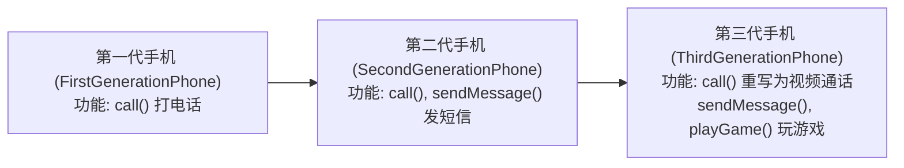
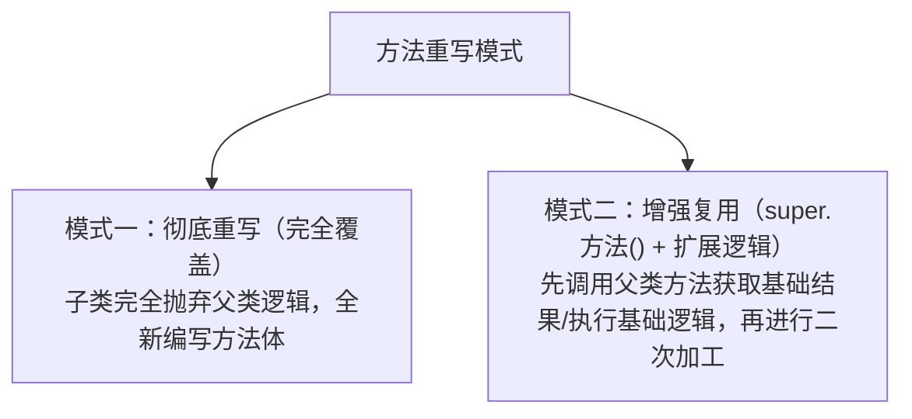
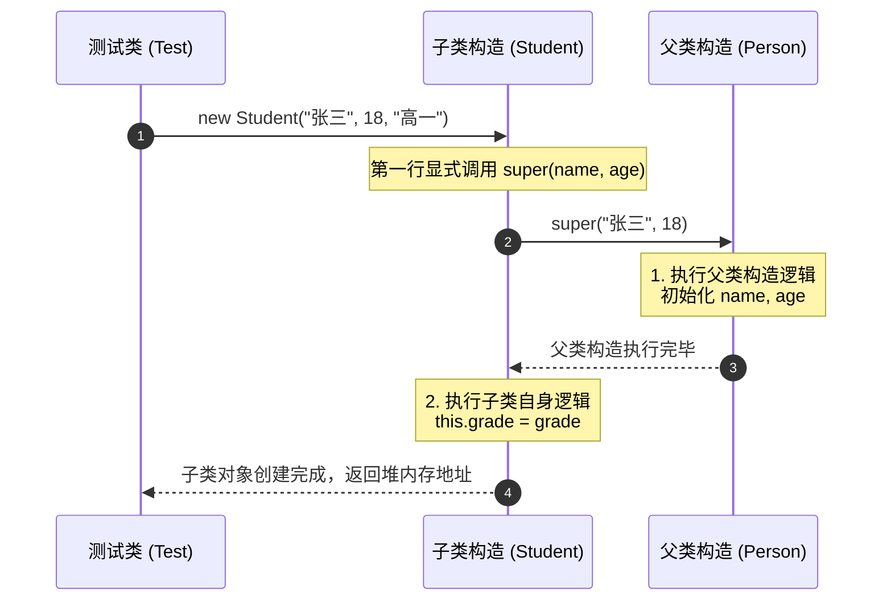
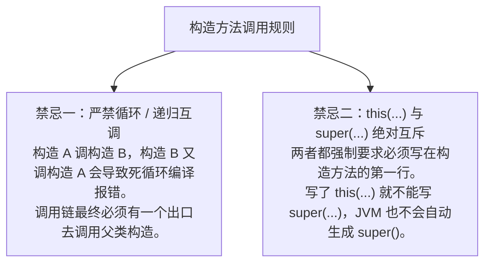
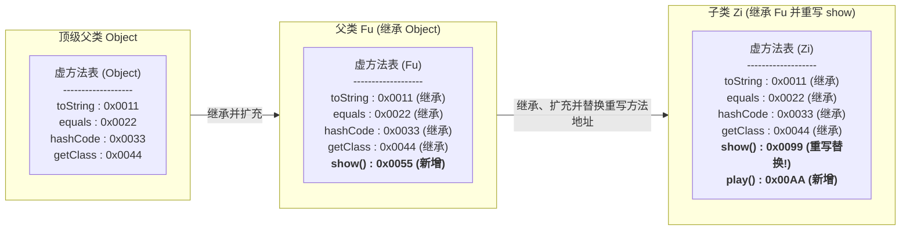
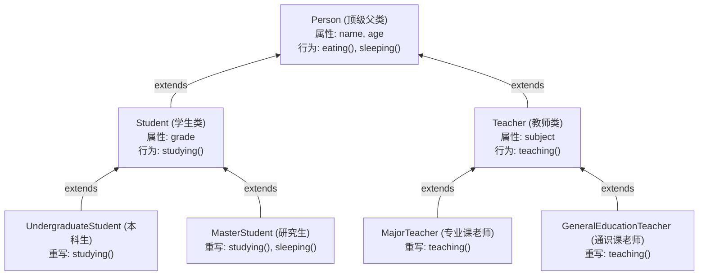

# Java 面向对象高级——继承 (Inheritance)

本章节记录 Java 面向对象三大特征之一——**继承 (Inheritance)** 的核心概念、设计原则、底层特点以及 `super` 关键字的使用规则。配套练习源码详见 `src/` 目录。

---

## 目录

1. [继承的基本概念与作用](#1-继承的基本概念与作用)
2. [继承结构的设计原则与实战案例](#2-继承结构的设计原则与实战案例)
3. [Java 继承的三大特点](#3-java-继承的三大特点)
4. [成员变量查找规则与 super 关键字](#4-成员变量查找规则与-super-关键字)
5. [成员方法访问规则与方法重写 (Method Overriding)](#5-成员方法访问规则与方法重写-method-overriding)
6. [继承中构造方法的特点与执行机制](#6-继承中构造方法的特点与执行机制)
7. [this 与 super 关键字全景对比与综合汇总](#7-this-与-super-关键字全景对比与综合汇总)
8. [继承的底层原理（虚方法表与内存机制，深入篇）](#8-继承的底层原理虚方法表与内存机制深入篇)
9. [Java 四大权限修饰符 (Access Modifiers)](#9-java-四大权限修饰符-access-modifiers)
10. [多层继承综合实战案例 (高校师生系统)](#10-多层继承综合实战案例-高校师生系统)
11. [本章练习源码索引](#11-本章练习源码索引)

---

## 1. 继承的基本概念与作用

### 1.1 什么是继承？
* **定义**：继承是面向对象三大特征（封装、继承、多态）之一。它可以让类与类之间产生**父子关系**。
* **作用**：
  * **抽取共性**：把多个子类中重复的代码抽取到父类中，子类可以直接使用。
  * **代码复用与扩展**：减少代码冗余，提高代码复用性；同时子类可以在父类的基础上新增特有功能，使子类更强大。

### 1.2 继承的语法格式
```java
public class 子类 extends 父类 {
    // 子类特有的属性和行为
}
```

### 1.3 继承相关术语对比

| 术语 | 英文 | 含义说明 |
| :--- | :--- | :--- |
| **子类 / 派生类** | Subclass / Derived Class | 继承其他类的类，可以继承父类的非私有成员，并进行扩展。 |
| **父类 / 基类 / 超类** | Superclass / Base Class / Super Class | 被继承的类，提供共性的属性和方法。 |

### 1.4 代码重构对比案例 (`Student` 与 `Teacher`)

#### 抽取前（存在大量重复代码）
```java
// Student.java
public class Student {
    String name;  // 重复属性
    int age;     // 重复属性
    String grade;

    public void eat() { ... } // 重复行为
    public void study() { ... }
}

// Teacher.java
public class Teacher {
    String name;  // 重复属性
    int age;     // 重复属性
    String subject;

    public void eat() { ... } // 重复行为
    public void teach() { ... }
}
```

#### 抽取后（使用继承结构）
```java
// Person.java (父类/基类)
package persondemo;

public class Person {
    String name;
    int age;

    public void eat() {
        System.out.println("吃饭");
    }
}

// Student.java (子类/派生类)
package persondemo;

public class Student extends Person {
    String grade;

    public void study() {
        System.out.println("学习");
    }
}

// Teacher.java (子类/派生类)
package persondemo;

public class Teacher extends Person {
    String subject;

    public void teach() {
        System.out.println("教学");
    }
}
```

---

## 2. 继承结构的设计原则与实战案例

### 2.1 如何正确设计继承结构？

设计继承结构时，必须遵循以下两大核心准则：
1. **抓共性**：当类与类之间存在相同（共性）的内容时，考虑抽取父类。
2. **满足 is-a 关系**：**子类必须是父类中的一种**（如 `Student` is a `Person`），且父类要能代表所有的子类。

#### 开发思维流程
* **画设计图时**：**自底向上**（从具体的子类出发，抓取共性，归纳出父类）。
* **编写代码时**：**自顶向下**（先定义并编写顶级父类，再逐级编写子类）。



---

### 2.2 实战案例：电子设备继承结构设计

#### 需求场景
需要描述智能设备（SmartDevices）、手机（Phone）、笔记本电脑（Laptop）、安卓手机（Android）、苹果手机（IOS）。

#### 两种设计方案对比

##### ❌ 方案 A：缺少中间抽象层（仍有冗余）
如果直接让 `安卓手机`、`苹果手机`、`笔记本电脑` 继承 `智能设备`：


* **缺陷**：`打电话()` 和 `发短信()` 在安卓手机和苹果手机中依然重复。

##### 方案 B：合理划分三层继承（最佳实践）
在 `智能设备` 和具体手机品牌之间抽出一个公共父类 `手机 (Phone)`：



#### 源码展示与测试 (`src/electronicdemo`)

```java
// SmartDevices.java
public class SmartDevices {
    String brand;
    int price;
}

// Phone.java
public class Phone extends SmartDevices {
    public void call() { System.out.println("打电话"); }
    public void sendMessage() { System.out.println("发短信"); }
}

// Laptop.java
public class Laptop extends SmartDevices {
    public void coding() { System.out.println("编程"); }
}

// Android.java
public class Android extends Phone {
    public void nfc() { System.out.println("NFC功能"); }
}

// IOS.java
public class IOS extends Phone { }
```

---

## 3. Java 继承的三大特点

### 3.1 特点一：单继承机制
* Java **只支持单继承**，**不支持多继承**（即一个子类只能有一个直接父类）。
* *错误示例*：`public class C extends A, B { }` ❌ （Java 语法不允许）。

---

### 3.2 特点二：支持多层继承
* Java **支持多层继承**，子类可以拥有直接父类和间接父类。
* **成员访问规则**：子类可以使用直接父类和间接父类的所有非私有属性和行为，但**不能访问同级同类（如“叔叔类”）的成员**。



---

### 3.3 特点三：顶级父类 `Object`
* 在 Java 中，如果一个类在定义时**没有显式指定其父类**，Java 虚拟机会**自动为其补上 `extends Object`**。
* `Object` 是 Java 中所有类的顶级父类/根类。因此，在任意一个对象上，都可以直接调用由 `Object` 继承下来的通用方法（如 `hashCode()`、`equals()`、`toString()`、`getClass()` 等）。

```java
// 显式声明
public class A extends Object { }

// 未显式声明（编译器会自动补充继承 Object）
public class A { }
```

IDE 在创建 `Android` 对象后输入 `a.` 智能提示的方法来源图解：
* **子类自身方法**：`nfc()`
* **直接父类 Phone / 间接父类 SmartDevices 方法及属性**：`call()`, `sendMessage()`, `brand`, `price`
* **顶级父类 Object 方法**：`equals()`, `hashCode()`, `toString()`, `getClass()`, `notify()`, `wait()`

---

## 4. 成员变量查找规则与 `super` 关键字

### 4.1 成员变量访问的“就近原则”
在继承体系中，访问一个成员变量时遵循**就近原则**：
1. 先在**局部位置**查找；
2. 找不到，去**本类成员位置**查找；
3. 找不到，去**父类成员位置**查找（逐级向上）。

---

### 4.2 `super` 关键字与重名成员变量

当子类成员变量与父类成员变量同名时，可以通过不同的关键字指定查找范围：

| 表达式 | 查找起点与行为 | 作用 |
| :--- | :--- | :--- |
| `name` | 从**局部位置**开始往上查找 | 默认优先使用局部变量 |
| `this.name` | 从**本类成员位置**开始往上查找 | 忽略局部变量，直接访问本类或继承获得的成员变量 |
| `super.name` | 从**直接父类成员位置**开始往上查找 | 强制跨过本类，去父类中查找重名变量 |

> ⚠️ **注意**：`super` 只能**向上找一级**，即只能在直接父类及更上层寻找，不能跨越访问无关类。

---

### 4.3 代码演示与实战细节 (`src/superdemo`)

```java
package superdemo;

public class Test {
    public static void main(String[] args) {
        Zi zi = new Zi();
        zi.show();
    }
}

class Fu {
    String name = "Fu";
    String address = "南京";
}

class Zi extends Fu {
    String name = "Zi";

    public void show() {
        String name = "ziShow";

        // 1. 输出 "ziShow"：遵循就近原则，找局部变量
        System.out.println(name);

        // 2. 输出 "Zi"：从本类成员位置查找
        System.out.println(this.name);

        // 3. 输出 "Fu"：强制去父类成员位置查找
        System.out.println(super.name);

        System.out.println("-------------------");

        // 4. 访问父类独有变量 address（本类未重名）
        // 以下三种写法均输出 "南京"，都是合法的：
        System.out.println(address);      // 本类没有，就近原则自动向上去父类查找
        System.out.println(this.address); // 本类没有，自动向上去父类查找
        System.out.println(super.address);// 直接去父类查找
    }
}
```

### 4.4 成员变量查找总结
1. **书写规则**：抽取共性成员变量放于父类中。
2. **访问特点**：遵循就近原则（局部 $\rightarrow$ 本类 $\rightarrow$ 父类）。
3. **同名区分**：
   * 直接写变量名 $\rightarrow$ 局部优先
   * `this.变量名` $\rightarrow$ 本类成员优先
   * `super.变量名` $\rightarrow$ 父类成员优先

---

## 5. 成员方法访问规则与方法重写 (Method Overriding)

### 5.1 成员方法的访问规则
在继承体系中，成员方法的定义与调用遵循如下核心规则：
* **书写规则**：将多个子类中共性的成员方法抽取到父类中，子类无需重复编写。
* **调用规则（就近原则）**：
  1. 优先在**本类**中查找；
  2. 本类找不到，自动向上到**直接父类**及更上层查找；
  3. 通过 `this.方法名()` 显式指定从本类开始查找；通过 `super.方法名()` 显式指定直接去父类查找。

#### 成员方法就近原则代码演示
```java
class Fu {
    public void eat() {
        System.out.println("吃米饭，吃菜~");
    }

    public void drink() {
        System.out.println("喝开水");
    }
}

class Zi extends Fu {
    // 情况：在子类方法中调用其他方法
    public void lunch() {
        // 1. 本类没有定义 eat() 和 drink()，根据就近原则自动调用父类中的方法
        eat();        // 等价于 this.eat();
        drink();      // 等价于 this.drink();

        System.out.println("-------------------");

        // 2. 显式使用 super 关键字直接调用父类方法
        super.eat();
        super.drink();
    }
}
```

---

### 5.2 什么是方法重写？

#### 1. 定义与核心概念
* **定义**：在继承体系中，**子类出现了和父类一模一样的方法声明**（方法名、形参列表完全一致），我们就称子类的这个方法是**重写的方法**（Method Overriding，也称为覆盖）。
* **使用场景**：当父类中定义的方法**不能完全满足子类的业务需求**时，子类可以对该方法进行重新实现。

#### 2. 生活演进案例：三代手机的演变 (`src/rewritedemo1`)



```java
// 1. 第一代手机 (FirstGenerationPhone.java)
package rewritedemo1;

public class FirstGenerationPhone {
    public void call() {
        System.out.println("打电话");
    }
}

// 2. 第二代手机 (SecondGenerationPhone.java)
package rewritedemo1;

public class SecondGenerationPhone extends FirstGenerationPhone {
    public void sendMessage() {
        System.out.println("发短信");
    }
}

// 3. 第三代手机 (ThirdGenerationPhone.java)
package rewritedemo1;

public class ThirdGenerationPhone extends SecondGenerationPhone {
    // 重写父类的打电话方法，将传统通话升级为视频通话
    @Override
    public void call() {
        System.out.println("视频通话");
    }

    // 子类新增功能
    public void playGame() {
        System.out.println("玩游戏");
    }
}
```

---

### 5.3 `@Override` 注解详解

* **概念**：`@Override` 是 Java 提供的**重写注解（编译校验元数据）**，标注在子类重写的方法上方。
* **作用**：告诉编译器对该方法进行严格的语法校验。如果父类中不存在该方法声明（例如方法名手误写错、形参列表不匹配），**编译器会立即报错提示**。
* **开发规范**：尽管符合重写规范的方法省略 `@Override` 也能正常运行，但在实际开发中**强烈建议所有重写方法都显式加上 `@Override`**。

#### 深入理解：注释 vs 注解
| 对比维度 | 注释 (Comment) | 注解 (Annotation) |
| :--- | :--- | :--- |
| **面向受众** | 面向**程序员**，提供可读的文字说明 | 面向**编译器 / JVM 虚拟机**，提供元数据指示 |
| **生效阶段** | 仅存在于源码阶段，编译生成 `.class` 后被编译器完全抹除 | 参与编译期语法检查，甚至可通过反射在运行期读取并执行特定逻辑 |

---

### 5.4 方法重写的两种开发模式

在实际业务开发中，方法重写主要有以下两种实现方式：



#### 模式一：彻底重写（完全覆盖）
子类完全不需要父类的实现，直接编写新的业务逻辑。例如上述 `ThirdGenerationPhone` 将 `call()` 彻底替换为 `"视频通话"`。

#### 模式二：增强复用（`super.方法()` + 二次加工）
当子类需要保留并复用父类的基础逻辑，同时追加子类特有的增强逻辑时，使用 `super.方法()`。

##### 电商阶梯折扣实战案例 (`src/rewritedemo2`)
* **业务需求**：
  1. 所有智能设备（手机、笔记本、平板）均有商品名与价格，并遵循统一的阶梯折扣规则：
     * `[0, 1000)` 元：不打折
     * `[1000, 5000)` 元：9 折
     * `[5000, 10000)` 元：8 折
     * `10000` 元及以上：7 折
  2. **手机享有额外补贴**：在基础阶梯折扣的基础上，享受**折上 9 折**优惠。
  3. 笔记本电脑与平板电脑不享受额外补贴。

```java
// SmartDevice.java (父类：通用阶梯折扣计算)
package rewritedemo2;

public class SmartDevice {
    String name;
    double price;

    public double payment() {
        if (price >= 0 && price < 1000) return price;
        else if (price >= 1000 && price < 5000) return price * 0.9;
        else if (price >= 5000 && price < 10000) return price * 0.8;
        else if (price >= 10000) return price * 0.7;
        else return 0;
    }
}

// Phone.java (子类：通过 super.payment() 增强复用)
package rewritedemo2;

public class Phone extends SmartDevice {
    @Override
    public double payment() {
        // 先调用父类方法计算出基础阶梯价，再在此基础上打 9 折
        return super.payment() * 0.9;
    }
}

// Laptop.java / Tablet.java (子类：无额外补贴，直接沿用父类逻辑)
package rewritedemo2;

public class Laptop extends SmartDevice {
    @Override
    public double payment() {
        return super.payment();
    }
}
```

---

### 5.5 方法重写的核心规则与注意事项

方法重写必须严格遵守以下 6 大语法规范：

| 序号 | 规则要点 | 规则说明与代码示例 |
| :---: | :--- | :--- |
| **1** | **方法签名一致** | 重写方法的**方法名**与**形参列表**必须与父类完全相同。方法体按子类需求自由编写。 |
| **2** | **访问权限限制** | 子类重写的方法访问权限**必须 $\ge$ 父类方法权限**。<br>权限大小关系：`private` < `缺省(default)` < `protected` < `public`。<br>*例*：父类方法为 `protected`，子类只能是 `protected` 或 `public`。 |
| **3** | **返回值类型限制** | 子类重写的方法返回值类型**必须 $\le$ 父类方法返回值类型**（协变返回类型）。<br>*例*：父类方法返回 `Person`，子类重写时可以返回 `Student`（子类），但**绝不能返回 `Object`（父类的父类）**。基本类型返回值必须完全一致。 |
| **4** | **开发建议** | 在绝大多数日常开发中，**建议将重写的方法声明（权限、返回值、方法名、形参）与父类保持完全一致**。 |
| **5** | **final 限制** | `final` 修饰的方法为最终方法，**不能被子类重写**；`final` 修饰的类为最终类，**不能被继承**。 |
| **6** | **private 与 static 限制** | ① **`private` 私有方法不能被重写**（子类对其不可见，子类中若定义同名方法仅属于子类自身的普通新方法）。<br>② **`static` 静态方法不能被重写**（静态方法属于类，子类中若声明同名静态方法属于“方法隐藏”，不能加 `@Override`）。 |

---

## 6. 继承中构造方法的特点与执行机制

### 6.1 为什么父类中的构造方法不会被子类继承？
* **根本原因**：Java 语法规范要求**构造方法的方法名必须与当前类名完全一致**。
* **冲突分析**：如果子类继承了父类的构造方法，子类中就会包含一个与“父类名”相同的构造方法，这直接破坏了构造方法命名的语法规则。
* **结论**：**父类的构造方法绝不会被子类继承**。子类如果想要使用父类的构造逻辑，必须通过 `super` 关键字进行调用。

---

### 6.2 子类构造方法的默认行为（隐式 `super()`）
* **规则**：在子类所有的构造方法中，第一行都隐藏着一个默认的 `super();` 调用。
* **编译器行为**：如果程序员没有显式写出构造方法调用语句，**JVM 编译器会自动在子类构造方法的第一行补上 `super();`**，去调用父类的无参构造方法。

---

### 6.3 显式调用父类有参构造 `super(...)`
* 当父类中没有无参构造，或者子类需要在实例化时将共性属性传递给父类进行初始化，子类必须在构造方法的第一行**手动显式编写 `super(参数1, 参数2, ...)`**。
* `super(...)` 必须位于子类构造方法的第一行，否则编译报错。

---

### 6.4 构造方法的执行顺序与生命周期
* **执行顺序**：创建子类对象时，**先执行父类的构造方法，后执行子类的构造方法**。
* **底层设计原因**：子类继承了父类的成员变量和行为，子类对象在构造过程中可能会使用父类中的数据。为了保证数据的安全与一致性，**必须先开辟并初始化父类的存储空间，然后再初始化子类独有的内容**。

#### 构造方法执行链路图解


---

### 6.5 代码演示 (`src/inheritdemo1`)

```java
// Person.java (父类)
package inheritdemo1;

public class Person {
    String name;
    int age;

    public Person() {
        System.out.println("父类空参构造执行");
    }

    public Person(String name, int age) {
        this.name = name;
        this.age = age;
        System.out.println("父类有参构造执行");
    }
}

// Student.java (子类)
package inheritdemo1;

public class Student extends Person {
    String grade;

    public Student() {
        // 第一行默认隐藏: super();
        System.out.println("子类Student空参构造执行");
    }

    public Student(String name, int age, String grade) {
        super(name, age); // 显式调用父类有参构造，必须写在第一行
        this.grade = grade;
        System.out.println("子类Student有参构造执行");
    }
}

// Test.java (测试运行)
package inheritdemo1;

public class Test {
    public static void main(String[] args) {
        System.out.println("--- 1. 触发无参构造 ---");
        Student s1 = new Student();
        // 控制台输出：
        // 父类空参构造执行
        // 子类Student空参构造执行

        System.out.println("\n--- 2. 触发有参构造 ---");
        Student s2 = new Student("李四", 20, "大一");
        // 控制台输出：
        // 父类有参构造执行
        // 子类Student有参构造执行
    }
}
```

---

## 7. `this` 与 `super` 关键字全景对比与综合汇总

### 7.1 `this` 与 `super` 的核心本质
* **`this` 关键字**：
  * **内存视角**：表示**当前方法调用者对象的堆内存地址值**。
  * **代码视角**：用于访问**本类**的成员（本类成员变量、本类成员方法、本类其他构造方法）。
* **`super` 关键字**：
  * **本质**：代表**父类存储空间或直接父类成员的访问入口**。
  * **代码视角**：用于直接访问**直接父类**的成员（父类成员变量、父类成员方法、父类构造方法）。

---

### 7.2 全景用法矩阵对照表

| 关键字 | 访问成员变量 | 访问成员方法 | 访问构造方法 |
| :--- | :--- | :--- | :--- |
| **`this`** | `this.成员变量`<br>访问本类成员变量（若本类没有则向上去父类找） | `this.成员方法(...)`<br>先访问本类成员方法，本类没有则向上去父类找 | `this(...)`<br>调用**本类**的其他构造方法 |
| **`super`** | `super.成员变量`<br>直接访问**父类**成员变量 | `super.成员方法(...)`<br>直接访问**父类**成员方法 | `super(...)`<br>调用**直接父类**的构造方法 |

---

### 7.3 `this(...)` 调用本类其他构造方法与赋默认值技巧 (`src/inheritdemo2`)

在编写 JavaBean 时，经常会遇到**为某些属性设置默认值**的需求。此时可以利用 `this(...)` 在无参构造中调用带参构造：

```java
package inheritdemo2;

public class Student {
    String name;
    int age;

    public Student() {
        // 使用 this(...) 调用本类的双参构造方法，赋予默认初始值
        this("同学", 18);
    }

    public Student(String name, int age) {
        this.name = name;
        this.age = age;
    }
}
```

---

### 7.4 构造方法调用的两大核心禁忌

在构造方法中使用 `this(...)` 和 `super(...)` 时，必须严格遵守以下两条铁律：



> [!CAUTION]
> **互斥原理**：因为 `super(...)` 和 `this(...)` 都必须写在构造方法的第一行，因此**一个构造方法中绝不能同时出现 `this(...)` 和 `super(...)`**。当使用 `this(...)` 调用本类其他构造时，JVM 不会在当前构造中插入 `super()`，而是由被调用的那个目标构造方法负责去调用父类构造。

---

## 8. 继承的底层原理（虚方法表与内存机制，深入篇）

### 8.1 类的字节码加载顺序
在 Java 程序执行时，当首次创建子类对象或调用子类静态成员时，JVM 会触发类加载：
* **加载顺序**：**先加载直接父类及顶层父类的字节码文件 (`.class`)，最后才加载子类的字节码文件**。

---

### 8.2 子类究竟能继承父类的什么？

下表总结了子类对父类不同成员的继承与访问权限：

| 父类成员分类 | 是否能被子类继承？ | 底层内存与访问机制分析 |
| :--- | :---: | :--- |
| **构造方法** | ❌ **不能** | 构造方法名与类名强绑定，不能继承；子类通过 `super(...)` 显式或隐式调用。 |
| **成员变量** | ✅ **能（全部继承）** | **无论是 `public` 还是 `private` 变量，都会在子类对象堆内存中开辟空间存储**。<br>但 `private` 变量受限于访问权限，子类无法直接通过 `对象.变量` 访问，必须通过父类提供的 `public` Getter/Setter 方法间接操作。 |
| **成员方法** | ✅ **能（继承虚方法表）** | 子类继承父类的**虚方法表 (Virtual Method Table)**。非虚方法不会进入虚方法表。 |

---

### 8.3 什么是虚方法 (Virtual Method)？

* **定义**：虚方法是指**普通的、支持动态绑定（多态与重写）的成员方法**。
* **判定标准**：**非 `final`、非 `static`、非 `private`** 的成员方法即为虚方法。
* **顶级父类 `Object` 的虚方法**：`Object` 类中共包含 5 个核心虚方法（`toString()`, `equals()`, `hashCode()`, `getClass()`, `clone()` 等），它们构成 Java 虚方法表的根基。

---

### 8.4 虚方法表 (vtable) 的继承、扩充与重写替换机制

JVM 在加载类时，会为每个类在方法区维护一张**虚方法表 (vtable)**：
1. **复制父类虚方法表**：子类在加载时，首先全盘复制直接父类的虚方法表；
2. **扩充子类特有虚方法**：子类中新定义的非 `final`、非 `static`、非 `private` 方法会被追加到虚方法表末尾；
3. **方法重写 (Override) 的底层实质**：如果子类重写了父类虚方法表中的某个方法，**子类虚方法表中该方法的函数入口地址会被替换为子类重写后的新方法地址**。



---

### 8.5 虚方法表的设计哲学：空间换时间
* **传统查找代价**：如果没有虚方法表，每当调用一个方法时，虚拟机都必须沿着继承链逐层向上递归搜索。当继承体系层次较深时，查找开销极大。
* **虚方法表的优势**：JVM 通过在方法区中为每个类预先构建一张虚方法表，将方法调用转化为**数组/索引的直接寻址（$O(1)$ 时间复杂度）**。虽然占用了一点额外的方法区内存，但换取了程序运行期极高的方法调用性能。

---

### 8.6 非虚方法 (`final`, `static`, `private`) 的调用与优化机制

非虚方法不会进入虚方法表，JVM 采取了针对性的静态绑定与调用优化：

| 方法类型 | 编译期行为 | 运行期行为与优化 |
| :--- | :--- | :--- |
| **`final` 方法** | 沿继承链向上查找确定定义在哪个类中，固化记录方法入口地址。 | 运行期直接跳转执行编译期确定的地址，无法被重写。 |
| **`static` 静态方法** | 编译期向上遍历确定归属类，并将对象调用方式（如 `s.method()`）**直接在底层重写优化为类名调用（`Student.method()`）**。 | 运行期直接通过类名调用，效率最高（因此推荐直接使用类名调用静态方法）。 |
| **`private` 私有方法** | 仅限本类内部可见，编译期直接绑定为本类私有指令。 | 运行期直接本类执行，对外完全封闭，不参与虚方法分派。 |

---

## 9. Java 四大权限修饰符 (Access Modifiers)

### 9.1 权限修饰符概述
权限修饰符用于控制类、成员变量、成员方法以及构造方法的**访问可见性范围**。

权限范围由小到大排序：
$$\text{private} < \text{缺省 / 默认 (default)} < \text{protected} < \text{public}$$

---

### 9.2 四大权限修饰符访问范围矩阵对照表

| 权限修饰符 | 同一个类中 | 同一个包中其他类<br>(含本包子类与本包无关类) | 不同包下的子类 | 不同包下的无关类 |
| :--- | :---: | :---: | :---: | :---: |
| **`private`** | ✅ **允许** | ❌ 禁止 | ❌ 禁止 | ❌ 禁止 |
| **`缺省 / 默认`**<br>(空着不写) | ✅ **允许** | ✅ **允许** | ❌ 禁止 | ❌ 禁止 |
| **`protected`** | ✅ **允许** | ✅ **允许** | ✅ **允许** | ❌ 禁止 |
| **`public`** | ✅ **允许** | ✅ **允许** | ✅ **允许** | ✅ **允许** |

> [!NOTE]
> * **本包中其他类**：无论该类是子类还是完全没有继承关系的无关类，只要在**同一个包下**，访问权限是完全等同的。
> * **`protected` 核心特权**：允许跨包访问，但**仅限不同包下的子类通过继承体系访问**，不同包的无关类无法访问。

---

### 9.3 权限修饰符的开发设计规范与最佳实践

在实际 Java 企业级开发中，权限修饰符的推荐搭配如下：

| 修饰目标 | 推荐修饰符 | 设计规范与原因 |
| :--- | :--- | :--- |
| **成员变量** | **`private`** | 遵循面向对象封装原则，隐藏内部数据细节，防止外部随意篡改，统一对外暴露 `public` 的 Getter/Setter。 |
| **构造方法** | **`public`** | 绝大多数类需要供外部自由实例化。<br>*特例*：工具类构造方法、单例模式构造方法需使用 **`private`**。 |
| **常规成员方法** | **`public`** | 作为对外提供的功能接口，方便外部对象自由调用。 |
| **内部辅助方法** | **`private`** | 仅供本类内部方法复用或拆分逻辑的辅助函数，不对外暴露。 |
| **继承扩展方法** | **`protected`** | 专门设计给子类继承或重写，但不希望被其他无关类调用的核心底层方法。 |

---

## 10. 多层继承综合实战案例 (高校师生系统)

### 10.1 需求背景与类架构设计 (`src/inheritdemo3`)

构建一套高校人员管理系统，包含如下多层继承结构：
1. **顶层基类 `Person`**：抽取所有人员的共性属性（`name`, `age`）与通用行为（`eating()`, `sleeping()`）。
2. **中间层子类**：
   * **`Student`**：继承 `Person`，扩展学段属性 `grade` 与共性学习行为 `studying()`。
   * **`Teacher`**：继承 `Person`，扩展授课科目属性 `subject` 与共性教学行为 `teaching()`。
3. **具体业务层子类**：
   * **`UndergraduateStudent` (本科生)**：继承 `Student`，重写 `studying()` 为“攻读学士学位”。
   * **`MasterStudent` (研究生)**：继承 `Student`，重写 `studying()` 为“攻读硕士学位”，重写 `sleeping()` 为“研究生豪华公寓睡觉”。
   * **`MajorTeacher` (专业课教师)**：继承 `Teacher`，重写 `teaching()` 为“教授专业课程”。
   * **`GeneralEducationTeacher` (通识课教师)**：继承 `Teacher`，重写 `teaching()` 为“教授通识课程”。

### 10.2 系统 UML 继承架构图



### 10.3 核心测试与运行验证

```java
package inheritdemo3;

public class Test {
    public static void main(String[] args) {
        // 1. 本科生测试
        UndergraduateStudent s1 = new UndergraduateStudent("John", 20, "大二");
        System.out.println(s1.getName() + " 年龄: " + s1.getAge() + " 年级: " + s1.getGrade());
        s1.eating();   // 继承自 Person
        s1.sleeping(); // 继承自 Person
        s1.studying(); // UndergraduateStudent 重写
        System.out.println("-------------------");

        // 2. 研究生测试
        MasterStudent s2 = new MasterStudent("Alice", 25, "研一");
        System.out.println(s2.getName() + " 年龄: " + s2.getAge() + " 年级: " + s2.getGrade());
        s2.eating();   // 继承自 Person
        s2.sleeping(); // MasterStudent 重写：豪华版公寓睡觉
        s2.studying(); // MasterStudent 重写：攻读硕士学位
        System.out.println("-------------------");

        // 3. 专业课老师测试
        MajorTeacher t1 = new MajorTeacher("Bob", 40, "高等数学");
        System.out.println(t1.getName() + " 年龄: " + t1.getAge() + " 教授科目: " + t1.getSubject());
        t1.eating();   // 继承自 Person
        t1.sleeping(); // 继承自 Person
        t1.teaching(); // MajorTeacher 重写：教授专业课程
        System.out.println("-------------------");

        // 4. 通识课老师测试
        GeneralEducationTeacher t2 = new GeneralEducationTeacher("Charlie", 35, "世界历史");
        System.out.println(t2.getName() + " 年龄: " + t2.getAge() + " 教授科目: " + t2.getSubject());
        t2.eating();   // 继承自 Person
        t2.sleeping(); // 继承自 Person
        t2.teaching(); // GeneralEducationTeacher 重写：教授通识课程
    }
}
```

---

## 11. 本章练习源码索引

在 `04-OOP-Extends/src` 目录下对应的练习代码：

| 包名 | 代码文件清单 | 核心知识点演练 |
| :--- | :--- | :--- |
| **`persondemo`** | [`Person.java`](./src/persondemo/Person.java), [`Student.java`](./src/persondemo/Student.java), [`Teacher.java`](./src/persondemo/Teacher.java), [`Test.java`](./src/persondemo/Test.java) | 继承基础概念：共性成员抽取与 `extends` 语法 |
| **`electronicdemo`** | [`SmartDevices.java`](./src/electronicdemo/SmartDevices.java), [`Phone.java`](./src/electronicdemo/Phone.java), [`Laptop.java`](./src/electronicdemo/Laptop.java), [`Android.java`](./src/electronicdemo/Android.java), [`IOS.java`](./src/electronicdemo/IOS.java), [`Test.java`](./src/electronicdemo/Test.java) | 继承结构设计：三层抽象设计原则与 `is-a` 关系 |
| **`superdemo`** | [`Test.java`](./src/superdemo/Test.java) | 成员变量访问的“就近原则”与 `super` / `this` 关键字查找机制 |
| **`rewritedemo1`** | [`FirstGenerationPhone.java`](./src/rewritedemo1/FirstGenerationPhone.java), [`SecondGenerationPhone.java`](./src/rewritedemo1/SecondGenerationPhone.java), [`ThirdGenerationPhone.java`](./src/rewritedemo1/ThirdGenerationPhone.java), [`Test.java`](./src/rewritedemo1/Test.java) | 方法重写基础演练：三代手机演变与 `@Override` 注解 |
| **`rewritedemo2`** | [`SmartDevice.java`](./src/rewritedemo2/SmartDevice.java), [`Phone.java`](./src/rewritedemo2/Phone.java), [`Laptop.java`](./src/rewritedemo2/Laptop.java), [`Tablet.java`](./src/rewritedemo2/Tablet.java), [`Test.java`](./src/rewritedemo2/Test.java) | 方法重写进阶：电商阶梯打折与 `super.payment()` 增强复用模式 |
| **`inheritdemo1`** | [`Person.java`](./src/inheritdemo1/Person.java), [`Student.java`](./src/inheritdemo1/Student.java), [`Teacher.java`](./src/inheritdemo1/Teacher.java), [`Test.java`](./src/inheritdemo1/Test.java) | 构造方法执行顺序：默认隐式 `super()` 与显式 `super(...)` 调用 |
| **`inheritdemo2`** | [`Student.java`](./src/inheritdemo2/Student.java), [`Test.java`](./src/inheritdemo2/Test.java) | `this(...)` 调用本类其他构造方法为属性赋予默认初值 |
| **`inheritdemo3`** | [`Person.java`](./src/inheritdemo3/Person.java), [`Student.java`](./src/inheritdemo3/Student.java), [`Teacher.java`](./src/inheritdemo3/Teacher.java), [`UndergraduateStudent.java`](./src/inheritdemo3/UndergraduateStudent.java), [`MasterStudent.java`](./src/inheritdemo3/MasterStudent.java), [`MajorTeacher.java`](./src/inheritdemo3/MajorTeacher.java), [`GeneralEducationTeacher.java`](./src/inheritdemo3/GeneralEducationTeacher.java), [`Test.java`](./src/inheritdemo3/Test.java) | 多层继承综合架构实战：高校师生系统及多层方法重写 |

