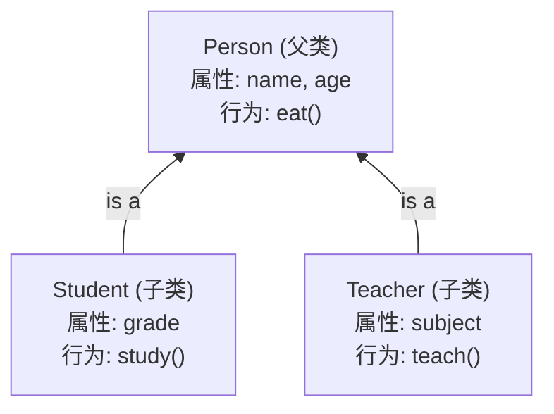
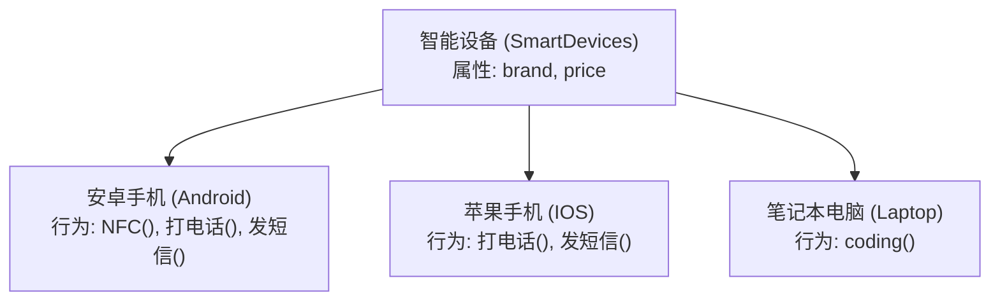
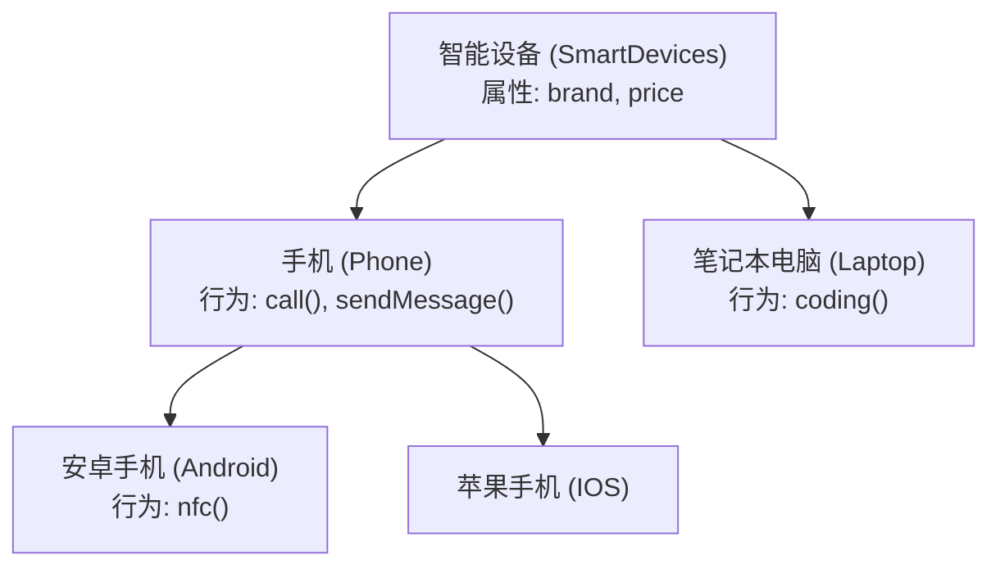
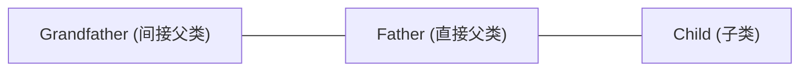

# Java 面向对象高级——继承 (Inheritance)

本章节记录 Java 面向对象三大特征之一——**继承 (Inheritance)** 的核心概念、设计原则、底层特点以及 `super` 关键字的使用规则。配套练习源码详见 `src/` 目录。

---

## 目录

1. [继承的基本概念与作用](#1-继承的基本概念与作用)
2. [继承结构的设计原则与实战案例](#2-继承结构的设计原则与实战案例)
3. [Java 继承的三大特点](#3-java-继承的三大特点)
4. [成员变量查找规则与 super 关键字](#4-成员变量查找规则与-super-关键字)

---

## 1. 继承的基本概念与作用

### 1.1 什么是继承？
* **定义**：继承是面向对象三大特征（封装、继承、多态）之一。它可以让类与类之间产生**父子关系**。
* **作用**：
  * **抽取共性**：把多个子类中重复的代码抽取到父类中，子类可以直接使用。
  * **代码复用与扩展**：减少代码冗余，提高代码复用性；同时子类可以在父类的基础上新增特有功能，使子类更强大。

### 1.2 继承的语法格式
```java
public class 子类 extends 父类 {
    // 子类特有的属性和行为
}
```

### 1.3 继承相关术语对比

| 术语 | 英文 | 含义说明 |
| :--- | :--- | :--- |
| **子类 / 派生类** | Subclass / Derived Class | 继承其他类的类，可以继承父类的非私有成员，并进行扩展。 |
| **父类 / 基类 / 超类** | Superclass / Base Class / Super Class | 被继承的类，提供共性的属性和方法。 |

### 1.4 代码重构对比案例 (`Student` 与 `Teacher`)

#### 抽取前（存在大量重复代码）
```java
// Student.java
public class Student {
    String name;  // 重复属性
    int age;     // 重复属性
    String grade;

    public void eat() { ... } // 重复行为
    public void study() { ... }
}

// Teacher.java
public class Teacher {
    String name;  // 重复属性
    int age;     // 重复属性
    String subject;

    public void eat() { ... } // 重复行为
    public void teach() { ... }
}
```

#### 抽取后（使用继承结构）
```java
// Person.java (父类/基类)
package persondemo;

public class Person {
    String name;
    int age;

    public void eat() {
        System.out.println("吃饭");
    }
}

// Student.java (子类/派生类)
package persondemo;

public class Student extends Person {
    String grade;

    public void study() {
        System.out.println("学习");
    }
}

// Teacher.java (子类/派生类)
package persondemo;

public class Teacher extends Person {
    String subject;

    public void teach() {
        System.out.println("教学");
    }
}
```

---

## 2. 继承结构的设计原则与实战案例

### 2.1 如何正确设计继承结构？

设计继承结构时，必须遵循以下两大核心准则：
1. **抓共性**：当类与类之间存在相同（共性）的内容时，考虑抽取父类。
2. **满足 is-a 关系**：**子类必须是父类中的一种**（如 `Student` is a `Person`），且父类要能代表所有的子类。

#### 开发思维流程
* **画设计图时**：**自底向上**（从具体的子类出发，抓取共性，归纳出父类）。
* **编写代码时**：**自顶向下**（先定义并编写顶级父类，再逐级编写子类）。



---

### 2.2 实战案例：电子设备继承结构设计

#### 需求场景
需要描述智能设备（SmartDevices）、手机（Phone）、笔记本电脑（Laptop）、安卓手机（Android）、苹果手机（IOS）。

#### 两种设计方案对比

##### ❌ 方案 A：缺少中间抽象层（仍有冗余）
如果直接让 `安卓手机`、`苹果手机`、`笔记本电脑` 继承 `智能设备`：


* **缺陷**：`打电话()` 和 `发短信()` 在安卓手机和苹果手机中依然重复。

##### 方案 B：合理划分三层继承（最佳实践）
在 `智能设备` 和具体手机品牌之间抽出一个公共父类 `手机 (Phone)`：



#### 源码展示与测试 (`src/electronicdemo`)

```java
// SmartDevices.java
public class SmartDevices {
    String brand;
    int price;
}

// Phone.java
public class Phone extends SmartDevices {
    public void call() { System.out.println("打电话"); }
    public void sendMessage() { System.out.println("发短信"); }
}

// Laptop.java
public class Laptop extends SmartDevices {
    public void coding() { System.out.println("编程"); }
}

// Android.java
public class Android extends Phone {
    public void nfc() { System.out.println("NFC功能"); }
}

// IOS.java
public class IOS extends Phone { }
```

---

## 3. Java 继承的三大特点

### 3.1 特点一：单继承机制
* Java **只支持单继承**，**不支持多继承**（即一个子类只能有一个直接父类）。
* *错误示例*：`public class C extends A, B { }` ❌ （Java 语法不允许）。

---

### 3.2 特点二：支持多层继承
* Java **支持多层继承**，子类可以拥有直接父类和间接父类。
* **成员访问规则**：子类可以使用直接父类和间接父类的所有非私有属性和行为，但**不能访问同级同类（如“叔叔类”）的成员**。



---

### 3.3 特点三：顶级父类 `Object`
* 在 Java 中，如果一个类在定义时**没有显式指定其父类**，Java 虚拟机会**自动为其补上 `extends Object`**。
* `Object` 是 Java 中所有类的顶级父类/根类。因此，在任意一个对象上，都可以直接调用由 `Object` 继承下来的通用方法（如 `hashCode()`、`equals()`、`toString()`、`getClass()` 等）。

```java
// 显式声明
public class A extends Object { }

// 未显式声明（编译器会自动补充继承 Object）
public class A { }
```

IDE 在创建 `Android` 对象后输入 `a.` 智能提示的方法来源图解：
* **子类自身方法**：`nfc()`
* **直接父类 Phone / 间接父类 SmartDevices 方法及属性**：`call()`, `sendMessage()`, `brand`, `price`
* **顶级父类 Object 方法**：`equals()`, `hashCode()`, `toString()`, `getClass()`, `notify()`, `wait()`

---

## 4. 成员变量查找规则与 `super` 关键字

### 4.1 成员变量访问的“就近原则”
在继承体系中，访问一个成员变量时遵循**就近原则**：
1. 先在**局部位置**查找；
2. 找不到，去**本类成员位置**查找；
3. 找不到，去**父类成员位置**查找（逐级向上）。

---

### 4.2 `super` 关键字与重名成员变量

当子类成员变量与父类成员变量同名时，可以通过不同的关键字指定查找范围：

| 表达式 | 查找起点与行为 | 作用 |
| :--- | :--- | :--- |
| `name` | 从**局部位置**开始往上查找 | 默认优先使用局部变量 |
| `this.name` | 从**本类成员位置**开始往上查找 | 忽略局部变量，直接访问本类或继承获得的成员变量 |
| `super.name` | 从**直接父类成员位置**开始往上查找 | 强制跨过本类，去父类中查找重名变量 |

> ⚠️ **注意**：`super` 只能**向上找一级**，即只能在直接父类及更上层寻找，不能跨越访问无关类。

---

### 4.3 代码演示与实战细节 (`src/superdemo`)

```java
package superdemo;

public class Test {
    public static void main(String[] args) {
        Zi zi = new Zi();
        zi.show();
    }
}

class Fu {
    String name = "Fu";
    String address = "南京";
}

class Zi extends Fu {
    String name = "Zi";

    public void show() {
        String name = "ziShow";

        // 1. 输出 "ziShow"：遵循就近原则，找局部变量
        System.out.println(name);

        // 2. 输出 "Zi"：从本类成员位置查找
        System.out.println(this.name);

        // 3. 输出 "Fu"：强制去父类成员位置查找
        System.out.println(super.name);

        System.out.println("-------------------");

        // 4. 访问父类独有变量 address（本类未重名）
        // 以下三种写法均输出 "南京"，都是合法的：
        System.out.println(address);      // 本类没有，就近原则自动向上去父类查找
        System.out.println(this.address); // 本类没有，自动向上去父类查找
        System.out.println(super.address);// 直接去父类查找
    }
}
```

### 4.4 成员变量查找总结
1. **书写规则**：抽取共性成员变量放于父类中。
2. **访问特点**：遵循就近原则（局部 $\rightarrow$ 本类 $\rightarrow$ 父类）。
3. **同名区分**：
   * 直接写变量名 $\rightarrow$ 局部优先
   * `this.变量名` $\rightarrow$ 本类成员优先
   * `super.变量名` $\rightarrow$ 父类成员优先
