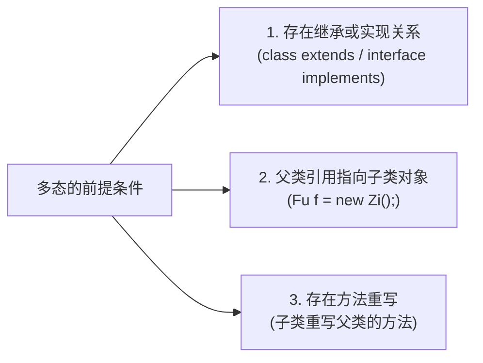
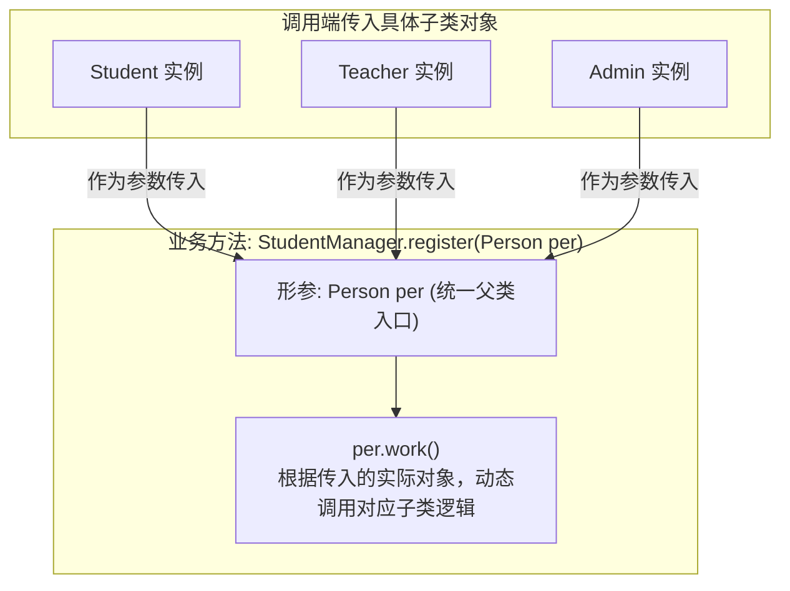
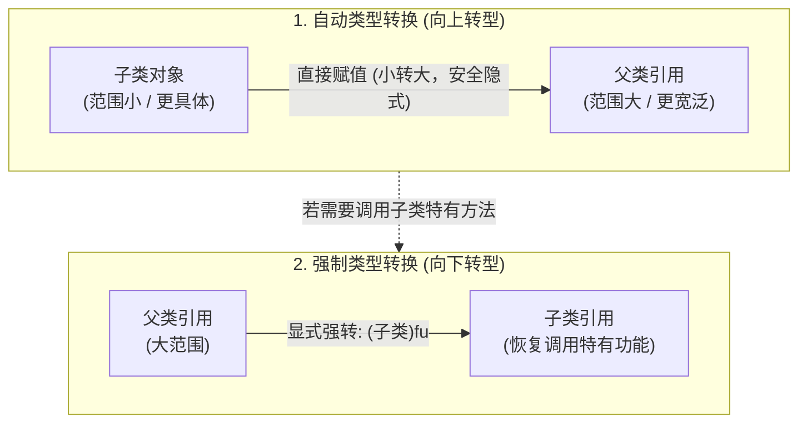
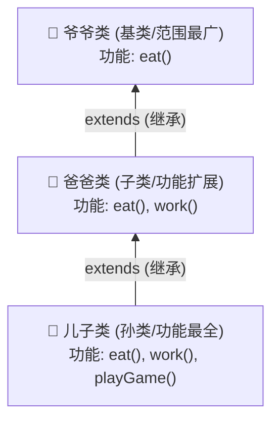
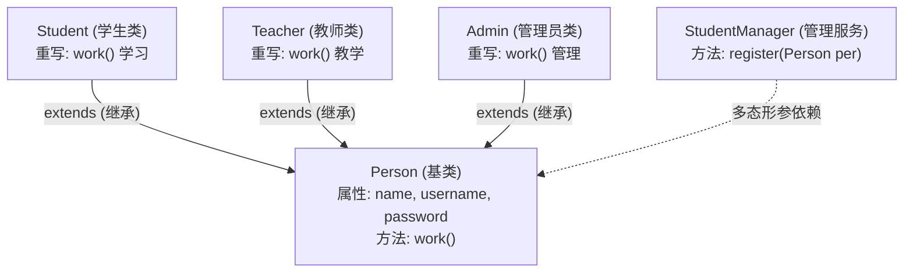
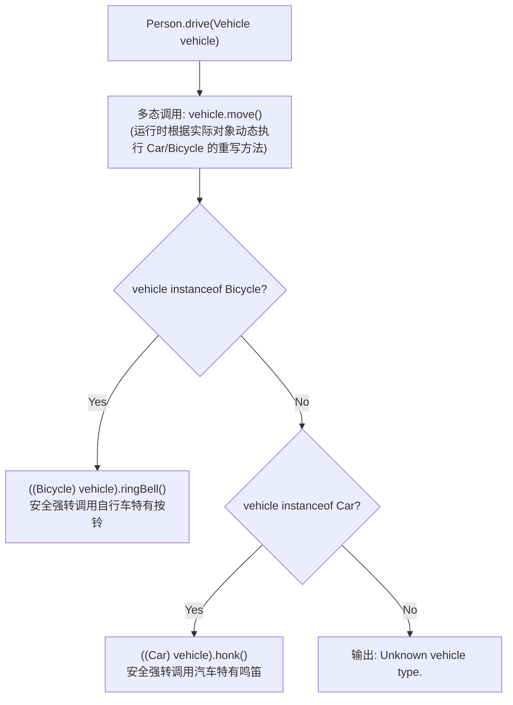

# Java 面向对象核心特征——多态 (Polymorphism)

本章节记录 Java 面向对象三大特征（封装、继承、多态）之一——**多态 (Polymorphism)** 的核心概念、语法形式、成员访问特点、底层原理、类型转换（向上/向下转型）以及 `instanceof` 关键字的使用与最佳实践。配套练习源码详见 `src/` 目录。

---

## 目录

1. [多态的基本概念与前提条件](#1-多态的基本概念与前提条件)
2. [多态的核心优势与设计意义](#2-多态的核心优势与设计意义)
3. [多态中成员的访问特点与底层机制](#3-多态中成员的访问特点与底层机制)
4. [多态的弊端与引用类型转换](#4-多态的弊端与引用类型转换)
5. [安全向下转型：instanceof 关键字](#5-安全向下转型instanceof-关键字)
6. [核心重点总结与高频自测问答 (Q&A)](#6-核心重点总结与高频自测问答-qa)
7. [综合实战案例剖析](#7-综合实战案例剖析)
8. [本章练习源码索引](#8-本章练习源码索引)

---

## 1. 多态的基本概念与前提条件

### 1.1 什么是多态？
* **定义**：多态是指**同一行为在不同对象上表现出不同的形态**。简而言之，就是“同一种事物，在不同条件下的多种表现形态”。
* **现实生活举例**：
  * **动物发出叫声**：猫叫是“喵喵”，狗叫是“汪汪”，羊叫是“咩咩”。
  * **按下开机键**：电脑开机启动操作系统，手机开机点亮屏幕，电视开机显示频道。

---

### 1.2 多态的表现形式

在 Java 代码中，多态的最基本表现形式为：**父类类型引用指向子类对象**。

```java
// 语法格式
父类类型 对象名称 = new 子类对象();

// 常见示例
Fu f = new Zi();
Person per = new Student();
Vehicle v = new Car();
```

---

### 1.3 多态的三大前提条件

实现多态必须具备以下三大条件：



1. **有继承 / 实现关系**：子类必须继承父类（`extends`）或实现接口（`implements`）。
2. **有父类引用指向子类对象**：声明的变量类型为父类，实际 new 出来的实体为子类。
3. **有方法重写（可选，但通常是多态的核心）**：若没有方法重写，多态调用方法时执行的永远是父类的方法，就失去了“多态性”的动态多变意义。

---

## 2. 多态的核心优势与设计意义

在面向对象设计中，多态带来了极其强大的灵活性和可维护性：

### 2.1 好处一：形参多态化，提升代码的复用性与扩展性
* **定义**：在方法定义中，如果使用**父类类型**作为形参，该方法就可以**无缝接收该父类对象以及所有派生子类对象**。
* **业务价值**：当系统后续需要新增子类时，已有业务方法无需做任何修改，直接传入新子类对象即可，完美符合设计模式中的**开闭原则（对扩展开放，对修改关闭）**。

#### 架构流程图（以用户注册为例）：



---

### 2.2 好处二：动态绑定，实现同一接口的不同行为
* 如果子类重写了父类的方法，在多态调用该方法时，程序会在**运行时动态调用对应子类中重写的方法**。
* 编写调用逻辑的人只需要面向父类编写统一调用，具体的行为差异由各个子类自身来实现。

---

## 3. 多态中成员的访问特点与底层机制

当通过父类引用调用对象的成员变量和成员方法时，Java 虚拟机有着截然不同的访问规则，这也是初学者最容易混淆的高频考点：

### 3.1 核心访问口诀

> [!IMPORTANT]
> - **成员变量**：**编译看左边，运行也看左边**
> - **成员方法**：**编译看左边，运行看右边**

---

### 3.2 规则深度拆解

| 成员分类 | 编译期检查 (javac) | 运行期执行 (java) | 核心原理解析 |
| :--- | :--- | :--- | :--- |
| **成员变量** | **看左边**（父类）<br/>看左边的父类中有没有该变量。有则编译通过，无则编译报错。 | **看左边**（父类）<br/>实际获取并打印的是父类中定义的变量值。 | **变量不支持重写**。成员变量是静态绑定的，在编译期就已经确定了变量在内存中的偏移地址，不具备多态特性。 |
| **成员方法** | **看左边**（父类）<br/>看左边的父类中有没有该方法。有则编译通过，无则编译报错。 | **看右边**（子类）<br/>实际执行的是右边真实创建的子类对象中重写的方法。 | **方法支持动态绑定**。Java 的非私有、非静态、非 final 实例方法都属于虚方法，运行时通过对象的**虚方法表 (vtable)** 动态分派。 |

---

### 3.3 代码对比验证

```java
// 父类
class Fu {
    String name = "Fu_Name";

    public void show() {
        System.out.println("Fu show()...");
    }
}

// 子类
class Zi extends Fu {
    String name = "Zi_Name";

    @Override
    public void show() {
        System.out.println("Zi show()...");
    }

    public void ziOnly() {
        System.out.println("Zi 特有方法");
    }
}

// 测试类
public class Test {
    public static void main(String[] args) {
        Fu f = new Zi(); // 多态对象

        // 1. 访问成员变量：编译看左(Fu)，运行看左(Fu)
        System.out.println(f.name); // 输出：Fu_Name

        // 2. 访问成员方法：编译看左(Fu)，运行看右(Zi)
        f.show(); // 输出：Zi show()...

        // 3. 访问子类特有方法：编译看左(Fu)，Fu中没有ziOnly()方法，直接报编译错误！
        // f.ziOnly(); // ❌ 编译报错：Cannot resolve method 'ziOnly' in 'Fu'
    }
}
```

---

## 4. 多态的弊端与引用类型转换

### 4.1 多态的天然弊端
由于多态调用在**编译期看左边**，父类引用**无法直接调用子类特有的成员变量和特有方法**。

```java
Fu f = new Zi();
f.ziSpecialMethod(); // ❌ 编译不通过，因为父类 Fu 中没有定义该方法
```

---

### 4.2 引用类型的两种转换方式

为了解决“多态无法调用子类特有功能”的问题，Java 提供了引用数据类型的转换机制：



#### 1. 自动类型转换（向上转型 Upcasting，从子到父）
* **格式**：`父类类型 变量名 = 子类对象;` （如 `Fu f = new Zi();`）
* **特点**：小范围类型转换为大范围类型，由系统自动完成，百分之百安全。

#### 2. 强制类型转换（向下转型 Downcasting，从父到子）
* **格式**：`子类类型 变量名 = (子类类型) 父类引用;` （如 `Zi z = (Zi) f;`）
* **作用**：将父类引用还原/转换为实际的真实子类对象，从而**重新获得调用子类特有属性与特有方法的能力**。

---

### 4.3 深入理解：“辈分与功能范围”经典模型

理解引用类型转换的关键在于理解类的继承层级与功能丰富度：

> [!TIP]
> **核心认知规律**：**“辈分越小，功能越全，囊括的东西越多。”**
> - **顶级父类（辈分最高）**：抽取的是最基础、最通用的共性，功能最少。
> - **末级子类（辈分最低）**：不仅继承了所有祖先的共性，还扩展了自身独有的丰富特性，功能最全、最广。

#### 爷爷、爸爸、儿子 三代层级演示：



我们来看看不同的强制类型转换情况：

| 代码场景 | 编译期表现 | 运行期表现 | 原因剖析 |
| :--- | :--- | :--- | :--- |
| **场景一：非法向下转型**<br/>`爷爷 ye = new 爸爸();`<br/>`儿子 er = (儿子) ye;` | **编译通过**<br/>（因为 `儿子` 是 `爷爷` 的后代，语法允许强转） | ❌ **运行抛出 `ClassCastException`** | 内存中真实 new 出来的对象只是 `爸爸`。<br/>`爸爸` 根本没有 `儿子` 的特有功能（如 `playGame()`），不能强转为功能更多的 `儿子`。 |
| **场景二：合法向上/向下转型**<br/>`爷爷 ye = new 儿子();`<br/>`爸爸 ba = (爸爸) ye;` | **编译通过** | ✅ **运行正常** | 内存中真实 new 出来的对象是 `儿子`。<br/>`儿子` 天生包含 `爸爸` 的所有能力，转为 `爸爸` 完全合法且安全。 |
| **场景三：完全还原真实类型**<br/>`爷爷 ye = new 儿子();`<br/>`儿子 er = (儿子) ye;` | **编译通过** | ✅ **运行正常** | 真实对象本身就是 `儿子`，强转回 `儿子` 后可顺利调用 `playGame()` 特有功能。 |

> [!WARNING]
> **强制类型转换规则总结**：
> 强制类型转换时，**转换后的目标类型不能比堆内存中真实 new 出来的对象类型“辈分更小（范围更窄/更具体）”**。真实对象是父类，就绝不能强转成其子类，否则必定在运行期抛出 `java.lang.ClassCastException`（类型转换异常）。

---

## 5. 安全向下转型：instanceof 关键字

### 5.1 为什么需要 `instanceof`？
在强制向下转型前，如果无法预先确定父类引用指向的到底是不是目标子类的对象，直接强转就会存在抛出 `ClassCastException` 的风险。
因此，必须在强转前进行类型检查——这就是 `instanceof` 关键字的核心使命。

### 5.2 `instanceof` 的语法与使用规范

```java
// 语法：
变量名 instanceof 目标类名
```
* **返回值**：布尔值 `boolean`（`true` 或 `false`）。
* **判定逻辑**：如果该变量所指向的内存真实对象是目标类本身，或者是目标类的子类实例，则返回 `true`；否则返回 `false`。

#### 经典安全转型代码模板：

```java
// 判断 y 是不是 Fu 类型（或某个具体子类类型）
if (y instanceof Fu) {
    Fu ff = (Fu) y; // 安全向下转型
    // 执行后续业务逻辑...
} else {
    System.out.println("请确定好类型，再进行转换");
}
```

---

### 5.3 进阶扩展：JDK 14/16+ 模式匹配 (Pattern Matching for instanceof)

在现代 Java（JDK 14 预览，JDK 16 正式）中，引入了 `instanceof` 模式匹配语法，可以在判断类型的同时自动完成向下转型，彻底告别冗余的显式强转：

```java
// 传统写法 (JDK 15 及以前)
if (vehicle instanceof Car) {
    Car c = (Car) vehicle;
    c.honk();
}

// 现代写法 (JDK 16+ 模式匹配)
if (vehicle instanceof Car c) {
    c.honk(); // 直接使用变量 c，无需再写 (Car) vehicle
}
```

---

## 6. 核心重点总结与高频自测问答 (Q&A)

### Q1: 多态的弊端是什么？
* **答**：**不能直接使用子类的特有功能**。因为多态在编译阶段“看左边”，若父类中没有声明子类的特有属性或特有方法，编译器会直接报错。

### Q2: 引用数据类型的类型转换有几种方式？
* **答**：有两种方式：
  1. **自动类型转换（向上转型 Upcasting）**：将子类对象赋值给父类类型的变量（由小变大，从子到父），系统自动完成。
  2. **强制类型转换（向下转型 Downcasting）**：将父类类型的变量强制还原为子类类型（由大变小，从父到子），需要显式书写 `(子类名)`。

### Q3: 强制类型转换能解决什么问题？需要注意什么？
* **答**：
  * **解决的问题**：能够将父类引用还原为其真实的子类类型，从而**顺利调用子类的特有方法与属性**。
  * **注意事项**：
    1. 目标类型必须与堆内存中的**真实对象类型保持一致（或是其父类型）**，不能转成比真实对象辈分更小的类型，否则运行期会抛出 `ClassCastException`。
    2. 进行强制向下转型前，**强烈建议使用 `instanceof` 关键字先进行类型判断**，确保类型安全。

---

### 知识点全景对照速查表

| 核心维度 | 向上转型 (Upcasting) | 向下转型 (Downcasting) |
| :--- | :--- | :--- |
| **转换方向** | 子类 $\rightarrow$ 父类（从具体到抽象） | 父类 $\rightarrow$ 子类（从抽象到具体） |
| **转换方式** | 自动完成，隐式转换 | 需显式声明：`(TargetType) variable` |
| **核心目的** | 统一接口规范，提高代码通用性与复用性 | 还原真实子类类型，调用子类特有功能 |
| **安全性** | 绝对安全，无运行时异常 | 存在风险，若类型不匹配会触发 `ClassCastException` |
| **防御手段** | 无需防御 | 强转前使用 `instanceof` 进行安全校验 |

---

## 7. 综合实战案例剖析

本章源码目录包含了两个经典业务场景，涵盖多态形参设计、方法重写分发以及 `instanceof` 安全向下转型的完整实战。

### 7.1 实战案例一：高校管理系统角色注册 (`studentmanager`)

* **设计背景**：系统中有学生（`Student`）、教师（`Teacher`）、管理员（`Admin`）三种角色，它们都继承自基类 `Person`。
* **多态应用**：`StudentManager` 的 `register` 方法只需接收统一的父类参数 `Person per`，即可完成对所有角色的注册，无需编写三个重载方法。



#### 核心代码节选：

```java
// 统一父类 Person.java
package studentmanager;

public class Person {
    private String name;
    private String username;
    private String password;

    public Person() {}

    public Person(String name, String username, String password) {
        this.name = name;
        this.username = username;
        this.password = password;
    }

    public String getName() { return name; }
    public String getUsername() { return username; }
    public String getPassword() { return password; }

    public void work() {
        System.out.println("Person is working");
    }
}

// 统一业务管理类 StudentManager.java
package studentmanager;

public class StudentManager {
    // 多态形参：可接收 Person 及其所有子类 (Student / Teacher / Admin)
    public void register(Person per) {
        System.out.println("姓名为" + per.getName() + "的账户注册成功，账号" + per.getUsername() + "，密码" + per.getPassword());
    }
}
```

---

### 7.2 实战案例二：交通工具综合出行与特有行为调用 (`transportation`)

* **设计背景**：交通工具基类 `Vehicle` 有 `move()` 方法，派生出自驾车 `Car`（特有功能 `honk()` 鸣笛）和自行车 `Bicycle`（特有功能 `ringBell()` 按铃）。
* **多态与安全强转**：`Person` 类的 `drive(Vehicle vehicle)` 方法统一调用 `vehicle.move()`（多态动态绑定），随后利用 `instanceof` 判断具体交通工具，安全向下转型并调用对应的特有功能。



#### 核心代码节选 (`Person.java`):

```java
package transportation;

public class Person {
    private String name;
    private int age;
    private String gender;

    // ... 构造器与 Getter/Setter ...

    public void drive(Vehicle vehicle) {
        // 1. 多态调用重写方法（编译看左边Vehicle，运行看右边具体子类）
        vehicle.move();

        // 2. 使用 instanceof 进行类型判断，并安全进行强制向下转型
        if (vehicle instanceof Bicycle) {
            Bicycle bicycle = (Bicycle) vehicle;
            bicycle.ringBell(); // 调用 Bicycle 特有方法
        } else if (vehicle instanceof Car) {
            Car car = (Car) vehicle;
            car.honk();         // 调用 Car 特有方法
        } else {
            System.out.println("Unknown vehicle type.");
        }
    }
}
```

#### 测试类验证 (`Test.java`):

```java
package transportation;

public class Test {
    public static void main(String[] args) {
        Person p = new Person("Alice", 30, "Female");
        
        // 向上转型：父类引用指向子类对象
        Vehicle v1 = new Bicycle("Schwinn", 15);
        Vehicle v2 = new Car("Toyota", 60);

        p.drive(v1); // 输出：Schwinn品牌的自行车正在行驶... 并鸣响车铃
        p.drive(v2); // 输出：Toyota品牌的汽车正在行驶... 并鸣响汽笛
    }
}
```

---

## 8. 本章练习源码索引

在 `05-OOP-Polymorphism/src` 目录下对应的练习代码：

| 包名 | 代码文件清单 | 核心知识点演练 |
| :--- | :--- | :--- |
| **`studentmanager`** | [`Person.java`](./src/studentmanager/Person.java), [`Student.java`](./src/studentmanager/Student.java), [`Teacher.java`](./src/studentmanager/Teacher.java), [`Admin.java`](./src/studentmanager/Admin.java), [`StudentManager.java`](./src/studentmanager/StudentManager.java), [`Test.java`](./src/studentmanager/Test.java) | 多态基础应用：父类引用作方法形参，统一管理多种派生子类 |
| **`transportation`** | [`Vehicle.java`](./src/transportation/Vehicle.java), [`Car.java`](./src/transportation/Car.java), [`Bicycle.java`](./src/transportation/Bicycle.java), [`Person.java`](./src/transportation/Person.java), [`Test.java`](./src/transportation/Test.java) | 多态综合实战：向上转型、动态方法调用、`instanceof` 类型识别与向下安全转型 |
