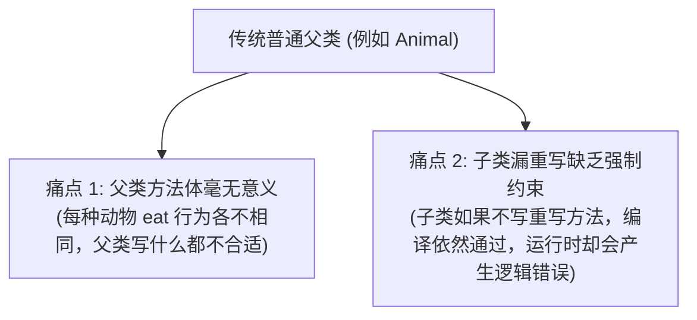
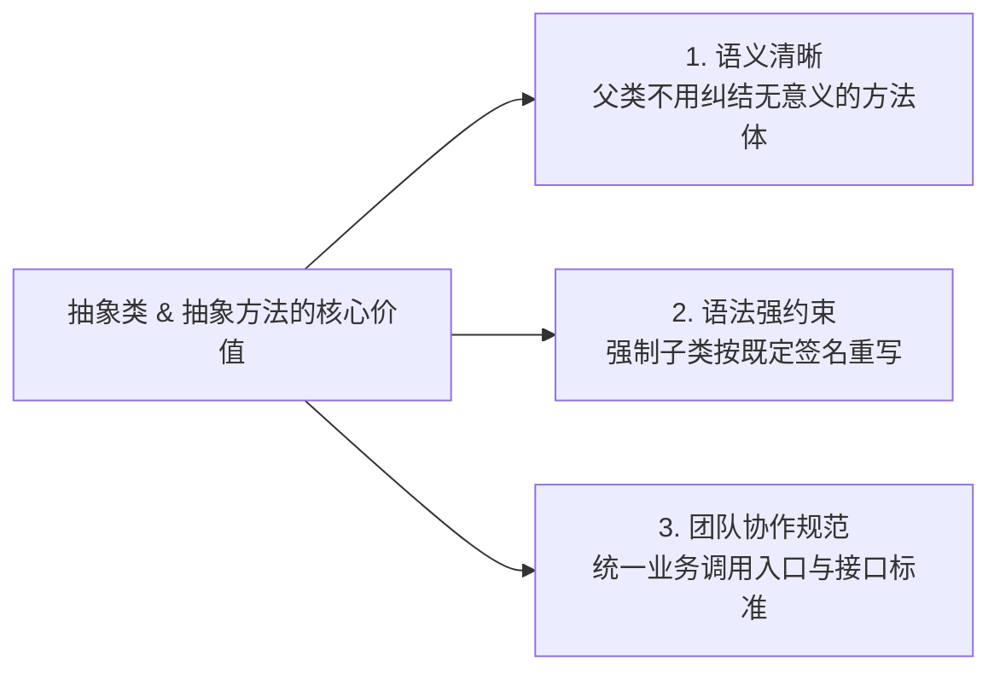
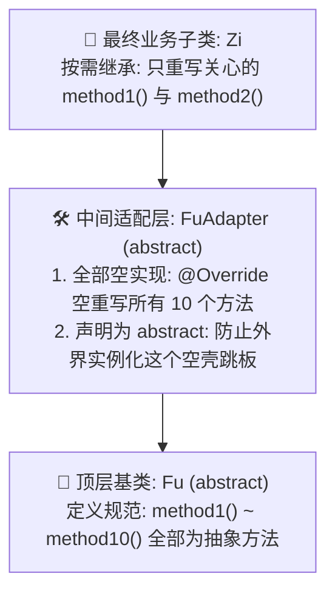
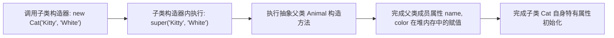
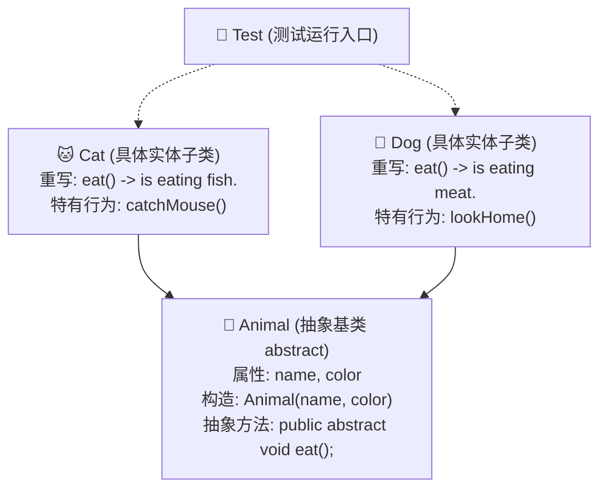

# Java 面向对象核心——抽象类与抽象方法 (Abstract Class)

本章节记录 Java 面向对象编程中的重要机制——**抽象类 (Abstract Class)** 与 **抽象方法 (Abstract Method)** 的核心概念、语法规则、设计意义、四大核心注意事项、缺省适配器模式（Default Adapter Pattern）以及构造方法在抽象类中的底层作用。配套练习源码详见 `src/` 目录。

---

## 目录

1. [抽象类的引入背景与产生原因](#1-抽象类的引入背景与产生原因)
2. [抽象类与抽象方法的语法定义](#2-抽象类与抽象方法的语法定义)
3. [抽象类和抽象方法的核心优势与设计意义](#3-抽象类和抽象方法的核心优势与设计意义)
4. [抽象类的四大核心注意事项与深度拆解](#4-抽象类的四大核心注意事项与深度拆解)
   - [4.1 注意点一：抽象类不能实例化（为什么禁止 new？）](#41-注意点一抽象类不能实例化为什么禁止-new)
   - [4.2 注意点二：抽象类中不一定有抽象方法（深入：缺省适配器模式）](#42-注意点二抽象类中不一定有抽象方法深入缺省适配器模式)
   - [4.3 注意点三：抽象类中可以有构造方法（不能 new 为什么还要构造方法？）](#43-注意点三抽象类中可以有构造方法不能-new-为什么还要构造方法)
   - [4.4 注意点四：抽象类的子类处理规则（全量重写 vs 声明抽象）](#44-注意点四抽象类的子类处理规则全量重写-vs-声明抽象)
5. [abstract 关键字的互斥规则（避坑指南）](#5-abstract-关键字的互斥规则避坑指南)
6. [核心重点总结与高频自测问答 (Q&A)](#6-核心重点总结与高频自测问答-qa)
7. [综合实战案例剖析](#7-综合实战案例剖析)
   - [7.1 实战案例一：动物继承体系与抽象方法约束 (`animaldemo`)](#71-实战案例一动物继承体系与抽象方法约束-animaldemo)
   - [7.2 实战案例二：缺省适配器模式设计 (`adapterdemo`)](#72-实战案例二缺省适配器模式设计-adapterdemo)
8. [本章练习源码索引](#8-本章练习源码索引)

---

## 1. 抽象类的引入背景与产生原因

在之前学习继承和多态时，我们通常会在父类中定义很多通用的方法，让子类继承并重写。但在实际开发中，我们经常会遇到以下两个严重痛点：

### 1.1 传统继承带来的两大痛点



1. **父类的方法体无法确定，写了也没有意义**：
   * 比如定义动物基类 `Animal`，它包含一个 `eat()` 方法。
   * 狗吃骨头/肉，猫吃鱼，牛吃草。每种动物的进食行为各不相同。在 `Animal` 父类中，根本无法给出一个通用的 `eat()` 方法实现；写任何具体逻辑都是不贴切的。
2. **缺乏强制约束力，子类不重写“拿它没办法”**：
   * 在普通类中，父类提供了普通方法后，子类如果忘记重写该方法，编译器**完全不会报错**。
   * 此时如果调用子类对象的该方法，执行的将是父类空洞且无意义的方法体，极易造成运行期隐蔽的业务 Bug。

---

### 1.2 解决方案：引入抽象类与抽象方法

为了解决上述问题，Java 提供了 `abstract` 关键字：
* **抽取行为标准，省去具体实现**：把父类中无法确定具体实现的方法声明为**抽象方法**，省去方法体 `{}`。
* **强制语法约束，漏写直接报错**：抽象方法所在的类必须声明为**抽象类**。Java 语法强制要求继承抽象类的具体子类**必须重写所有的抽象方法**，否则编译器直接报错，从编译期杜绝了遗漏重写的问题。

---

## 2. 抽象类与抽象方法的语法定义

### 2.1 抽象方法 (Abstract Method)

* **定义**：只有方法声明，没有方法体（没有大括号 `{}`）的方法，必须使用 `abstract` 关键字修饰。
* **语法格式**：
  ```java
  修饰符 abstract 返回值类型 方法名(形参列表);
  ```
* **示例**：
  ```java
  // 抽象方法直接以分号 ; 结尾，不能有大括号 {}
  public abstract void eat();
  public abstract void work(String task);
  ```

---

### 2.2 抽象类 (Abstract Class)

* **定义**：使用 `abstract` 关键字修饰的类即为抽象类。
* **语法格式**：
  ```java
  修饰符 abstract class 类名 {
      // 成员变量
      // 构造方法
      // 抽象方法 (0个或多个)
      // 普通成员方法
  }
  ```
* **示例**：
  ```java
  public abstract class Animal {
      private String name;
      private String color;

      public Animal() {}

      public Animal(String name, String color) {
          this.name = name;
          this.color = color;
      }

      // 抽象方法：强制子类去实现
      public abstract void eat();
  }
  ```

---

### 2.3 抽象类与普通类的核心特性对比表

| 对比维度 | 普通类 (Normal Class) | 抽象类 (Abstract Class) |
| :--- | :--- | :--- |
| **关键字修饰** | `class 类名` | `abstract class 类名` |
| **能否直接实例化 (`new`)** | **能**，可直接 `new Object()` 创建对象 | ❌ **不能**，直接 `new` 报编译错误 |
| **能否包含抽象方法** | ❌ **不能**，有抽象方法的类必须是抽象类 | **能**（可以有 0 个、1 个或多个抽象方法） |
| **能否包含普通方法** | **能** | **能**（完全可以包含带有具体方法体的普通方法） |
| **能否包含构造方法** | **能** | **能**（供子类对象通过 `super()` 调用初始化父类属性） |
| **子类继承要求** | 普通继承，按需重写 | 具体子类**必须重写所有抽象方法**，否则子类必须也是抽象类 |

---

## 3. 抽象类和抽象方法的核心优势与设计意义



1. **简化父类设计（语义清晰）**：
   * 父类不用再绞尽脑汁去编写一个没有任何实际意义的空实现或默认实现，代码结构更加纯粹干净。
2. **编译期强约束（防止漏写）**：
   * 只要方法被声明为 `abstract`，子类就必须显式重写并给出具体实现。如果漏写任何一个抽象方法，代码无法通过编译，有效降低协作风险。
3. **制定规范与统一标准（契约精神）**：
   * 抽象类作为模板，定义了整个继承体系“应该具备哪些能力（方法名、形参列表、返回值）”；
   * 具体子类则专注于“如何实现这些能力”，使得同一继承体系下的各个子类拥有高度一致的接口形态，极大方便了上层调用者的统一多态调度。

---

## 4. 抽象类的四大核心注意事项与深度拆解

关于抽象类与抽象方法的语法规则，必须牢记以下四大核心注意点：

> [!IMPORTANT]
> 1. **注意点 1**：抽象类**不能实例化**（不能直接 `new` 创建对象）。
> 2. **注意点 2**：抽象类中**不一定有抽象方法**；但拥有抽象方法的类**一定是抽象类**。
> 3. **注意点 3**：抽象类中**可以有构造方法**。
> 4. **注意点 4**：抽象类的子类，**要么重写所有的抽象方法**，**要么该子类也必须声明为抽象类**。

---

### 4.1 注意点一：抽象类不能实例化（为什么禁止 new？）

* **语法规则**：抽象类绝对不能被直接实例化（即不能通过 `new 抽象类名()` 来创建对象）。
* **底层原理剖析**：
  * 假设计算机允许 `Animal a = new Animal();` 创建了对象，那么外界就可以通过 `a.eat();` 去调用抽象方法。
  * 但抽象方法在父类中**根本没有方法体（没有具体执行指令）**，CPU 无法执行一段不存在的代码。
  * 因此，Java 从编译器底层直接禁止实例化抽象类，从根源上消除了调用“空方法体”带来的致命错误。

```java
// 错误示例：
Animal a = new Animal(); // ❌ 编译报错：'Animal' is abstract; cannot be instantiated
```

---

### 4.2 注意点二：抽象类中不一定有抽象方法（深入：缺省适配器模式）

很多人会产生疑惑：“既然抽象类中可以一个抽象方法都没有，那为什么还要把这个类声明为 `abstract` 呢？”

这条语法并非摆设，在设计模式中有着非常经典且广泛的应用——**缺省适配器模式 (Default Adapter Pattern / 接口适配器模式)**。

#### 1. 业务痛点：多接口全量实现的负担
假设我们有一个基类或接口 `Fu`，里面定义了多达 10 个抽象方法（`method1()` ~ `method10()`）。某一个业务子类 `Zi` 实际只需要用到其中的 `method1()` 和 `method2()`。
* 如果让 `Zi` 直接继承 `Fu`，根据语法规则，`Zi` **必须同时重写全部 10 个方法**，导致子类中充斥着 8 个空方法，冗余繁琐，极度不优雅。

#### 2. 解决方案：构建 Adapter 中间适配层
我们定义一个中间类 `FuAdapter` 继承 `Fu`，在 `FuAdapter` 中对这 10 个方法做**默认的空重写（`{}`）**。
然后让真正的业务子类 `Zi` 继承 `FuAdapter`，此时 `Zi` 就可以**按需只重写自己关心的 `method1()` 和 `method2()`**。

#### 3. 为什么 Adapter 必须声明为 `abstract`？
`FuAdapter` 只是一个过渡用的“空壳跳板”，里面所有的方法全都是空实现，没有任何具体的业务意义。**系统绝不应该允许外界直接 `new FuAdapter()` 来创建对象**。
为了防止外界实例化这个没有实际业务意义的适配器类，我们将其显式声明为 `abstract`——这正是“抽象类中可以没有抽象方法”的最典型实战应用！

#### 缺省适配器模式架构流程图：



> 📌 **图例说明**：
> - ───▶ **实线箭头 (`-->`)**：类继承关系（`extends`）

#### 代码模型演示：

```java
// 1. 顶层基类
public abstract class Fu {
    public abstract void method1();
    public abstract void method2();
    // ... method3 ~ method10
}

// 2. 缺省适配器（没有抽象方法，但声明为 abstract 防止被实例化）
public abstract class FuAdapter extends Fu {
    @Override public void method1() {}
    @Override public void method2() {}
    // ... 给 method3 ~ method10 均提供空重写 {}
}

// 3. 实际子类（干净整洁，按需重写）
public class Zi extends FuAdapter {
    @Override
    public void method1() {
        System.out.println("Zi 只实现 method1 的具体业务逻辑");
    }

    @Override
    public void method2() {
        System.out.println("Zi 只实现 method2 的具体业务逻辑");
    }
}
```

---

### 4.3 注意点三：抽象类中可以有构造方法（不能 new 为什么还要构造方法？）

很多人会困惑：“既然抽象类无法通过 `new` 实例化，那在抽象类里写构造方法有什么意义？”

> [!NOTE]
> **构造方法的核心使命不仅在于创建本类对象，还在于初始化本类的成员变量。**

1. **成员变量初始化链路**：
   * 抽象类中往往会定义共有的成员变量（如 `Animal` 中的 `name`、`color`）。
   * 当创建子类对象（如 `Cat cat = new Cat("Kitty", "White");`）时，子类的构造方法内部会通过 `super(name, color)` 显式或隐式地调用父抽象类的构造方法。
2. **内存分配逻辑**：
   * 在堆内存中开辟子类对象空间时，子类对象内部包含了从父抽象类继承下来的属性。
   * 父类的构造方法负责将这些属性进行赋值与初始化。



---

### 4.4 注意点四：抽象类的子类处理规则（全量重写 vs 声明抽象）

当一个类继承了抽象类之后，编译器给出了两种选择：

| 子类处理方案 | 语法要求 | 适用场景与优缺点 |
| :--- | :--- | :--- |
| **方案一：重写所有抽象方法** *(最常用)* | 子类必须重写父类中**所有**的抽象方法，并提供完整方法体 `{}`。 | **标准做法**。子类重写全部抽象方法后成为普通实体类，外界可以直接 `new 子类()` 投入使用。 |
| **方案二：子类也声明为抽象类** *(极少用)* | 子类类声明前也必须加上 `abstract` 修饰符，可只重写部分或完全不重写父类抽象方法。 | **基本用不到**。因为这样导致子类也无法实例化，后续还得再定义一个“孙子类”去继承子类，并最终重写所有层级的全部抽象方法。层级过深增加代码复杂度。 |

---

## 5. abstract 关键字的互斥规则（避坑指南）

`abstract` 关键字的核心本质是**“定义规范、留待子类继承并重写”**。因此，任何会导致“方法不能被重写”的关键字，都与 `abstract` 存在逻辑冲突，不能共存：

| 互斥组合 | 是否允许共存 | 冲突原因剖析 |
| :--- | :---: | :--- |
| `abstract` 与 `final` | ❌ **绝对禁止** | `final` 修饰的方法禁止被重写，`final` 修饰的类禁止被继承；而 `abstract` 强制要求被继承和重写，两者语义完全相悖。 |
| `abstract` 与 `private` | ❌ **绝对禁止** | `private` 修饰的方法只能在本类访问，子类根本不可见、无法重写；而 `abstract` 方法必须暴露给子类去重写。 |
| `abstract` 与 `static` | ❌ **绝对禁止** | `static` 修饰的方法属于类本身，可以通过 `类名.方法名()` 直接调用。但 `abstract` 方法没有方法体，若能通过类名直接调用抽象方法将毫无意义。 |

---

## 6. 核心重点总结与高频自测问答 (Q&A)

### Q1: 抽象类为什么不能直接创建对象（实例化）？
* **答**：抽象类中可能包含没有方法体的抽象方法。如果允许创建抽象类的实例，就可以通过该实例去调用没有方法体的方法，计算机无法执行，因此 Java 从语法层面直接禁止实例化抽象类。

### Q2: 既然抽象类不能 new 对象，为什么里面还能写构造方法？
* **答**：构造方法的作用不仅仅是实例化本类，更是为了**初始化本类中定义的成员变量**。当子类对象被创建时，子类构造方法会通过 `super(...)` 调用父抽象类的构造方法，从而完成继承自父类的成员变量的初始化。

### Q3: 抽象类中一定有抽象方法吗？反过来，有抽象方法的类一定是抽象类吗？
* **答**：
  1. **抽象类中不一定有抽象方法**：抽象类中可以包含 0 个、1 个或多个抽象方法，也可以全都是普通方法（例如缺省适配器模式）。
  2. **有抽象方法的类一定是抽象类**：只要一个类中包含了至少一个抽象方法，该类就必须显式声明为 `abstract`。

### Q4: 什么是缺省适配器模式？它是如何巧妙应用抽象类特性的？
* **答**：缺省适配器模式是指当一个基类或接口定义了大量抽象方法，而具体子类只需要使用其中一部分时，设计一个中间适配器类（Adapter）对所有抽象方法提供默认的空重写 `{}`。真正的子类继承该适配器类，按需重写所需方法。
* 适配器类本身只是一个空壳跳板，没有实际业务逻辑，为了防止外界直接实例化它，将其显式声明为 `abstract` 类。

---

## 7. 综合实战案例剖析

本章源码目录包含了两个经典业务模块，分别展示了抽象类的基础使用约束与缺省适配器的高级应用模式。

### 7.1 实战案例一：动物继承体系与抽象方法约束 (`animaldemo`)

* **设计背景**：定义抽象基类 `Animal`，包含属性 `name`、`color`、构造方法以及抽象方法 `public abstract void eat();`。派生出具体子类 `Cat` 和 `Dog`。
* **业务约束**：子类 `Cat` 和 `Dog` 必须重写 `eat()` 方法，否则无法通过编译。同时各子类拥有各自特有的扩展行为（`catchMouse()` / `lookHome()`）。



> 📌 **图例说明**：
> - ───▶ **实线箭头 (`-->`)**：类继承关系（`extends`，强制重写抽象方法）
> - ┈┈┈▶ **虚线箭头 (`-.->`)**：测试类实例化与方法调用依赖（`Dependency`）

#### 核心源码清单：

```java
// 抽象基类：Animal.java
package animaldemo;

public abstract class Animal {
    private String name;
    private String color;

    public Animal() {}

    public Animal(String name, String color) {
        this.name = name;
        this.color = color;
    }

    public String getName() { return name; }
    public void setName(String name) { this.name = name; }
    public String getColor() { return color; }
    public void setColor(String color) { this.color = color; }

    // 抽象方法：强制子类重写
    public abstract void eat();
}
```

```java
// 猫子类：Cat.java
package animaldemo;

public class Cat extends Animal {
    public Cat() { super(); }
    public Cat(String name, String color) { super(name, color); }

    @Override
    public void eat() {
        System.out.println(getName() + " is eating fish.");
    }

    public void catchMouse() {
        System.out.println(getName() + " is catching a mouse.");
    }
}
```

```java
// 狗子类：Dog.java
package animaldemo;

public class Dog extends Animal {
    public Dog() { super(); }
    public Dog(String name, String color) { super(name, color); }

    @Override
    public void eat() {
        System.out.println(getName() + " is eating meat.");
    }

    public void lookHome() {
        System.out.println(getName() + " is looking home.");
    }
}
```

```java
// 测试类：Test.java
package animaldemo;

public class Test {
    public static void main(String[] args) {
        Cat cat = new Cat("Kitty", "White");
        Dog dog = new Dog("Buddy", "Brown");

        System.out.println(cat.getName() + " is " + cat.getColor());
        cat.eat();
        cat.catchMouse();

        System.out.println(dog.getName() + " is " + dog.getColor());
        dog.eat();
        dog.lookHome();

        // 验证抽象类不可实例化：
        // Animal a = new Animal(); // ❌ 编译报错：'Animal' is abstract; cannot be instantiated
    }
}
```

---

### 7.2 实战案例二：缺省适配器模式设计 (`adapterdemo`)

* **设计背景**：顶层基类 `Fu` 定义了 10 个抽象方法（`method1` 到 `method10`）。
* **设计模式**：中间类 `FuAdapter` 声明为抽象类，重写了全部 10 个方法（提供空实现 `{}`）。
* **业务落地**：子类 `Zi` 只继承 `FuAdapter`，按需重写关心的 `method1()` 和 `method2()`，极大地精简了子类代码。

#### 核心源码清单：

```java
// 顶层抽象基类：Fu.java
package adapterdemo;

public abstract class Fu {
    public abstract void method1();
    public abstract void method2();
    public abstract void method3();
    public abstract void method4();
    public abstract void method5();
    public abstract void method6();
    public abstract void method7();
    public abstract void method8();
    public abstract void method9();
    public abstract void method10();
}
```

```java
// 缺省适配器类：FuAdapter.java (abstract 修饰防止外部 new 对象)
package adapterdemo;

public abstract class FuAdapter extends Fu {
    @Override public void method1() {}
    @Override public void method2() {}
    @Override public void method3() {}
    @Override public void method4() {}
    @Override public void method5() {}
    @Override public void method6() {}
    @Override public void method7() {}
    @Override public void method8() {}
    @Override public void method9() {}
    @Override public void method10() {}
}
```

```java
// 具体子类：Zi.java (按需重写)
package adapterdemo;

public class Zi extends FuAdapter {
    @Override
    public void method1() {
        System.out.println("Zi's method1 implementation");
    }

    @Override
    public void method2() {
        System.out.println("Zi's method2 implementation");
    }
}
```

```java
// 测试验证类：Test.java
package adapterdemo;

public class Test {
    public static void main(String[] args) {
        Zi zi = new Zi();
        zi.method1(); // 输出: Zi's method1 implementation
        zi.method2(); // 输出: Zi's method2 implementation
    }
}
```

---

## 8. 本章练习源码索引

在 `06-Abstract-Class/src` 目录下对应的练习代码：

| 包名 | 代码文件清单 | 核心知识点演练 |
| :--- | :--- | :--- |
| **`animaldemo`** | [`Animal.java`](./src/animaldemo/Animal.java), [`Cat.java`](./src/animaldemo/Cat.java), [`Dog.java`](./src/animaldemo/Dog.java), [`Test.java`](./src/animaldemo/Test.java) | 抽象类与抽象方法基础：抽象基类设计、构造器调用与 `super()` 变量初始化、子类强制重写与特有扩展 |
| **`adapterdemo`** | [`Fu.java`](./src/adapterdemo/Fu.java), [`FuAdapter.java`](./src/adapterdemo/FuAdapter.java), [`Zi.java`](./src/adapterdemo/Zi.java), [`Test.java`](./src/adapterdemo/Test.java) | 抽象类高级模式：缺省适配器模式（Default Adapter Pattern）、无抽象方法的 abstract 类应用场景 |
