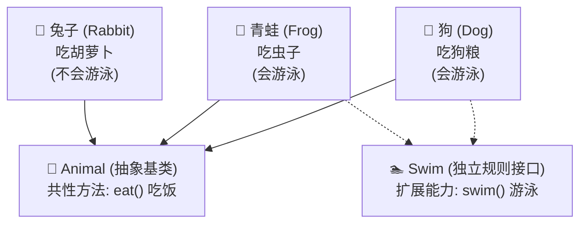
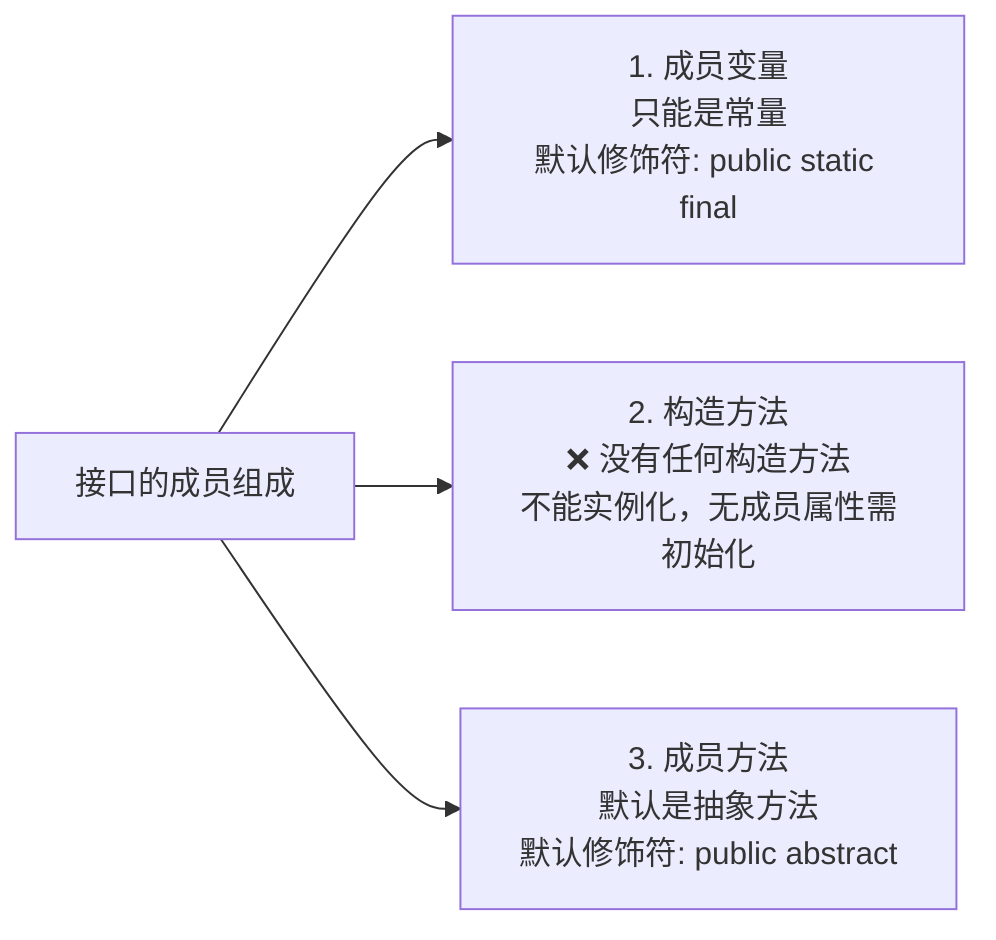
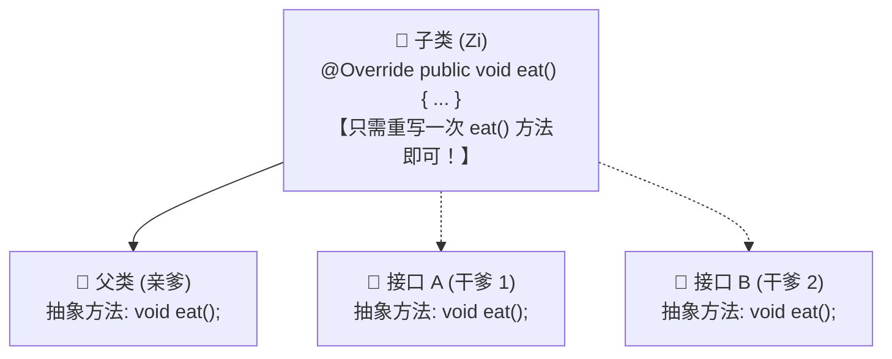
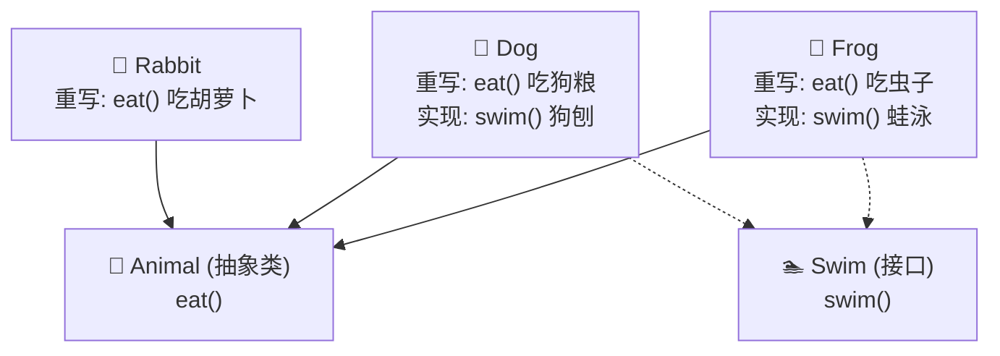
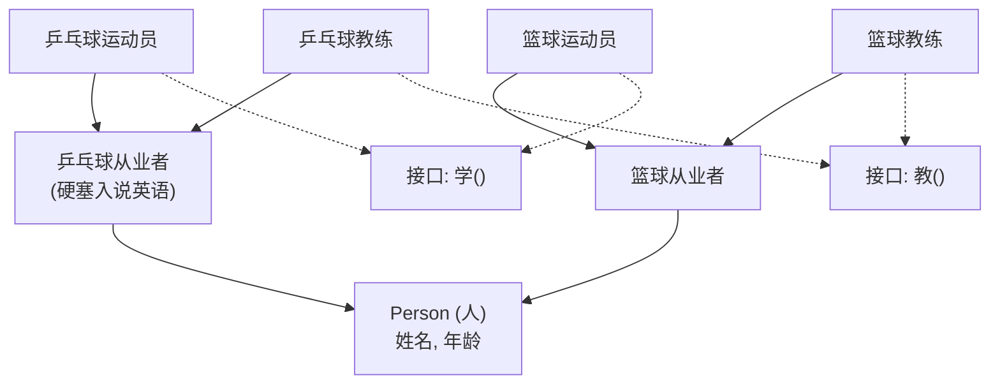
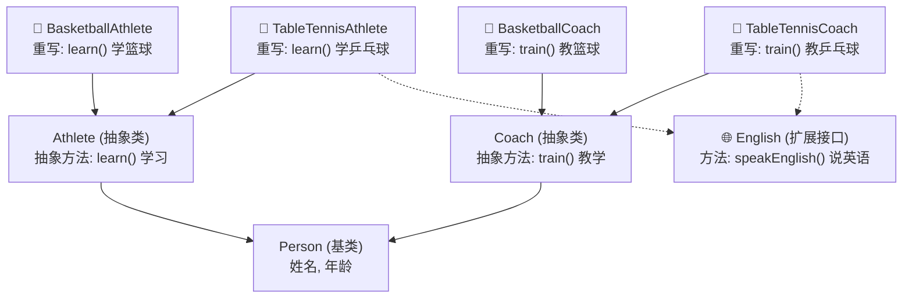

# Java 面向对象核心——接口 (Interface)

本章节记录 Java 面向对象编程中解耦与规范约束的核心机制——**接口 (Interface)**。内容涵盖接口的核心定义与设计初衷、语法规范、三大成员组成特点、类与接口的三大关系矩阵、重名方法冲突处理机制、接口与抽象类的全方位深度对比，以及运动员/教练员体系的架构设计选型实战。配套练习源码详见 `src/` 目录。

---

## 目录

1. [接口的基本概念与设计初衷](#1-接口的基本概念与设计初衷)
2. [接口的语法定义与基本使用](#2-接口的语法定义与基本使用)
3. [接口中成员的组成与特点](#3-接口中成员的组成与特点)
4. [类与接口的三大关系全景矩阵](#4-类与接口的三大关系全景矩阵)
   - [4.1 类与类的关系 (单继承 / 多层继承)](#41-类与类的关系-单继承--多层继承)
   - [4.2 类与接口的关系 (单实现 / 多实现 / 继承+实现)](#42-类与接口的关系-单实现--多实现--继承实现)
   - [4.3 接口与接口的关系 (单继承 / 多继承)](#43-接口与接口的关系-单继承--多继承)
   - [4.4 重名方法冲突处理机制（亲爹与干爹的经典比喻）](#44-重名方法冲突处理机制亲爹与干爹的经典比喻)
5. [接口与抽象类的全方位深度对比](#5-接口与抽象类的全方位深度对比)
6. [核心重点总结与高频自测问答 (Q&A)](#6-核心重点总结与高频自测问答-qa)
7. [综合实战案例剖析](#7-综合实战案例剖析)
   - [7.1 实战案例一：动物继承体系与 Swimming 扩展能力 (`animaldemo`)](#71-实战案例一动物继承体系与-swimming-扩展能力-animaldemo)
   - [7.2 实战案例二：运动员与教练员架构设计选型实战 (`athletedemo`)](#72-实战案例二运动员与教练员架构设计选型实战-athletedemo)
8. [本章练习源码索引](#8-本章练习源码索引)

---

## 1. 接口的基本概念与设计初衷

### 1.1 什么是接口？
* **定义**：接口（`Interface`）是 Java 中一种引用数据类型，是**独立于继承体系以外的规则与行为规范**。
* **本质**：接口是对**行为（能力）**的抽象。如果说类定义了“是什么（is-a）”，那么接口就定义了“具备什么能力（like-a / can-do）”。
* **通俗比喻**：
  > **“亲爹只能有一个（Java 类只支持单继承），干爹可以有无数个（Java 支持多实现接口）。”**

---

### 1.2 为什么需要接口？（以动物体系为例）

在没有接口时，如果我们要描述兔子（`Rabbit`）、青蛙（`Frog`）、狗（`Dog`）：



> 📌 **图例说明**：
> - ───▶ **实线箭头 (`-->`)**：类与类的继承关系（`extends`）
> - ┈┈┈▶ **虚线箭头 (`-.->`)**：类对接口的实现关系（`implements`）

* **痛点剖析**：
  1. **不能放在父类 `Animal` 中**：所有动物都要吃饭（`eat()` 是共性），但不是所有动物都会游泳（兔子不会游泳）。如果把 `swim()` 定义在父类 `Animal` 中，兔子就会被迫继承该方法，违背现实逻辑。
  2. **不能只各自写在子类中**：如果仅在 `Dog` 和 `Frog` 中各自独立写 `swim()` 方法，它们之间没有任何类型关联，无法利用多态实现统一管理（例如无法定义统一的 `Swim[] swimmers = {frog, dog};` 数组）。
* **接口方案**：
  * 将“游泳（`swim`）”抽离为一个**独立的接口规则**；
  * 谁具备这个能力，谁就去实现（`implements`）该接口；不具备能力的类（如兔子）则不实现。

---

## 2. 接口的语法定义与基本使用

### 2.1 接口的定义格式
使用 `interface` 关键字定义接口：

```java
public interface 接口名 {
    // 成员变量（常量）
    // 抽象方法
}
```

---

### 2.2 接口的实现格式
类与接口之间是**实现关系**，使用 `implements` 关键字：

```java
// 单实现
public class 类名 implements 接口名 {
    // 重写接口中的抽象方法
}

// 多实现
public class 类名 implements 接口名1, 接口名2 {
    // 重写所有接口中的抽象方法
}

// 继承父类的同时实现多个接口
public class 类名 extends 父类 implements 接口名1, 接口名2 {
    // 重写抽象父类与所有接口中的抽象方法
}
```

---

### 2.3 接口使用的三大核心注意事项

> [!IMPORTANT]
> 1. **注意点 1：接口不能实例化**
>    - 接口是纯粹的规则抽象，绝对不能直接通过 `new 接口名()` 创建对象。
> 2. **注意点 2：实现类的重写要求**
>    - 接口的子类（实现类），**要么重写接口中所有的抽象方法**；**要么该实现类必须声明为一个抽象类（`abstract`）**。
> 3. **注意点 3：多实现支持**
>    - 一个类可以同时实现多个接口，也可以在继承一个父类的同时实现多个接口。

---

## 3. 接口中成员的组成与特点

接口中的成员结构非常纯粹，Java 对其成员变量、构造方法、成员方法有着极其严格的语法约束：



### 3.1 成员变量：只能是常量
* **默认修饰符**：`public static final`。
* **书写建议**：在接口中定义成员变量时，修饰符 `public static final` 可以全部省略不写，系统会自动补充。
* **示例**：
  ```java
  public interface DemoInterface {
      // 完整写法：
      // public static final int MAX_AGE = 100;

      // 推荐简洁写法：
      int MAX_AGE = 100; // 依然是 public static final 常量
  }
  ```

---

### 3.2 构造方法：没有任何构造方法
* 接口中**绝对不能定义构造方法**。
* **原因剖析**：
  * 接口没有实例成员变量需要初始化（全部都是静态常量）；
  * 接口不能直接通过 `new` 实例化对象，因此完全不需要构造方法。

---

### 3.3 成员方法：默认是抽象方法
* **默认修饰符**：`public abstract`。
* **书写建议**：修饰符 `public abstract` 可以完全省略，直接写返回值类型和方法签名即可。
* **示例**：
  ```java
  public interface Swim {
      // 完整写法：
      // public abstract void swim();

      // 推荐简洁写法：
      void swim();
  }
  ```

> [!NOTE]
> **JDK 版本演进扩展（JDK 8+ / 9+）**：
> - **JDK 7 及以前**：接口中只能定义抽象方法。
> - **JDK 8 增加**：允许定义 `default` 默认方法（带方法体，用于接口平滑升级）和 `static` 静态方法（直接用 `接口名.方法名()` 调用）。
> - **JDK 9 增加**：允许定义 `private` 私有方法（用于抽取接口内部公共逻辑，不对外暴露）。

---

## 4. 类与接口的三大关系全景矩阵

在 Java 中，类与类、类与接口、接口与接口之间的关系及修饰关键字如下表所示：

| 关联双方 | 关键字 | 关系名称 | 单/多关系规则 | 核心细节与约束 |
| :--- | :---: | :--- | :--- | :--- |
| **类 与 类** | `extends` | 继承关系 | **只能单继承**，不可多继承，但可多层继承 | 子类只有一个直接父类（亲爹只有一个）。 |
| **类 与 接口** | `implements` | 实现关系 | **可以单实现，也可以多实现** | 一个类可以实现多个接口，也可以先 `extends` 父类再 `implements` 多个接口。 |
| **接口 与 接口** | `extends` | 继承关系 | **可以单继承，也可以多继承** | 接口之间使用 `extends` 关键字，且支持多继承（`interface A extends B, C`）。 |

---

### 4.1 类与类的关系 (单继承 / 多层继承)
* Java 中类只支持**单继承**，不支持多继承（防止方法签名相同时产生菱形继承冲突）。
* 但支持**多层继承**（爷爷 $\rightarrow$ 爸爸 $\rightarrow$ 儿子）。

---

### 4.2 类与接口的关系 (单实现 / 多实现 / 继承+实现)
* 一个类可以同时实现多个接口：`public class Zi implements InterA, InterB { ... }`
* 也可以在继承父类的同时实现接口：`public class Zi extends Fu implements InterA, InterB { ... }`
* **继承抽象父类的注意点**：
  1. 如果父类是一个抽象类，子类中需要把**父类的所有抽象方法**和**所有接口的所有抽象方法**全部重写。
  2. 若子类不想全部重写，则子类自身也必须声明为 `abstract` 抽象类。

---

### 4.3 接口与接口的关系 (单继承 / 多继承)
* 接口与接口之间是**继承关系**（使用 `extends` 关键字）。
* 接口**支持多继承**！
  ```java
  public interface InterA { void a(); }
  public interface InterB { void b(); }

  // 接口多继承：InterC 同时继承 InterA 和 InterB
  public interface InterC extends InterA, InterB {
      void c();
  }
  ```
* **注意点**：当接口 `InterC` 继承了 `InterA` 和 `InterB` 时，相当于把 A 和 B 中的抽象方法全部打包继承了下来。后续具体的实现类若 `implements InterC`，必须**一次性重写 A、B、C 中的全部抽象方法**。

---

### 4.4 重名方法冲突处理机制（亲爹与干爹的经典比喻）

当多个接口中出现了**重名的抽象方法**，或者父类与接口中出现了**重名的抽象方法**时，子类该如何处理？



> 📌 **图例说明**：
> - ───▶ **实线箭头 (`-->`)**：继承父类（`extends`，亲爹）
> - ┈┈┈▶ **虚线箭头 (`-.->`)**：实现接口（`implements`，干爹）

> [!TIP]
> **重名抽象方法处理口诀**：
> - **“如果多个接口（干爹）中出现了同名的抽象方法，实现类只需要重写一次即可。”**
> - **“如果父类（亲爹）与接口（干爹）中出现了同名的抽象方法，子类也只需要重写一次即可。”**
> - **通俗理解**：亲爹和干爹都让你去“打扫房间（`cleanRoom()`）”，你只要打扫一次房间，就同时满足了亲爹和所有干爹的要求。

---

## 5. 接口与抽象类的全方位深度对比

| 对比维度 | 抽象类 (Abstract Class) | 接口 (Interface) |
| :--- | :--- | :--- |
| **定义关键字** | `abstract class` | `interface` |
| **关系关键字** | 子类使用 `extends` 继承 | 实现类使用 `implements` 实现 |
| **继承/实现机制** | **单继承**（一个类只能继承一个直接父类） | **多实现**（一个类可实现多个接口，接口间可多继承） |
| **设计思想与理念** | **`is-a`（是什么）**<br/>体现继承体系的共性事物与本质归属 | **`like-a` / `can-do`（具备什么能力）**<br/>体现独立于继承体系之外的额外规则与功能插槽 |
| **成员变量** | 可以定义任意类型的普通变量、常量、静态变量 | 只能定义公共静态常量（默认 `public static final`） |
| **构造方法** | **有构造方法**（供子类对象通过 `super()` 初始化父类成员） | ❌ **没有构造方法** |
| **成员方法** | 可以包含抽象方法，也可以包含任意普通成员方法 | 默认全为抽象方法（`public abstract`）<br/>*(JDK 8+ 增 default/static，JDK 9+ 增 private)* |

---

## 6. 核心重点总结与高频自测问答 (Q&A)

### Q1: 接口和抽象类有什么区别？如何选择？
* **答**：
  1. **思想区别**：抽象类表示 `is-a` 关系（如猫是动物），用于抽取继承体系中的共性属性与方法；接口表示 `like-a` / `can-do` 关系（如狗会游泳、运动员会说英语），用于定义独立于继承体系的额外能力。
  2. **语法区别**：抽象类支持单继承、有构造方法、可定义普通成员变量；接口支持多实现、无构造方法、成员变量只能是 `public static final` 常量。
  3. **选型法则**：如果是事物固有的本质属性和共有行为，定义在抽象父类中；如果是部分事物特有的扩展功能或行为规范，定义在接口中。

### Q2: 为什么接口中的成员变量默认是 public static final？
* **答**：
  * **`public`**：接口是公开的规则标准，其中的常量必须允许外部任意实现类和调用方访问。
  * **`static`**：接口不能实例化，无法通过对象访问变量，必须声明为静态（`static`），以便直接通过 `接口名.变量名` 访问。
  * **`final`**：接口只制定标准规范，不应持有具体对象的可变状态，因此必须是不可修改的常量（`final`）。

### Q3: 为什么接口中没有构造方法？
* **答**：
  * 构造方法主要用于对象的实例化以及成员变量的初始化。
  * 接口不能直接 `new` 实例化，且接口内部所有成员变量都是静态常量（在类加载时已初始化完毕），无需由构造方法动态赋值，因此接口不需要构造方法。

### Q4: 如果一个类实现的两个接口中有同名、同参数签名的抽象方法，子类怎么处理？
* **答**：子类只需要**重写该方法一次**即可。因为抽象方法只有方法签名而没有具体实现，一次重写便同时满足了两个接口对该方法签名的规范要求。

---

## 7. 综合实战案例剖析

本章源码目录提供了两个经典业务场景，分别展示了基础能力插槽设计与大型多层继承+多接口实战选型。

### 7.1 实战案例一：动物继承体系与 Swimming 扩展能力 (`animaldemo`)

* **需求设计**：
  * 抽象基类 `Animal`：包含属性 `name`、`color`、构造方法与抽象方法 `public abstract void eat();`。
  * 接口 `Swim`：定义游泳规则 `public void swim();`。
  * `Rabbit`：只继承 `Animal`，重写 `eat()`（吃胡萝卜）。
  * `Dog`：继承 `Animal` 并实现 `Swim`，重写 `eat()`（吃狗粮）和 `swim()`（狗刨）。
  * `Frog`：继承 `Animal` 并实现 `Swim`，重写 `eat()`（吃虫子）和 `swim()`（蛙泳）。
  * 测试类中利用接口多态数组 `Swim[] swimmers = {frog, dog};` 统一调用游泳行为。



> 📌 **图例说明**：
> - ───▶ **实线箭头 (`-->`)**：继承抽象基类（`extends Animal`）
> - ┈┈┈▶ **虚线箭头 (`-.->`)**：实现能力接口（`implements Swim`）

#### 核心源码节选：

```java
// 游泳接口 Swim.java
package animaldemo;

public interface Swim {
    public void swim();
}
```

```java
// 狗类 Dog.java（单继承 + 单实现）
package animaldemo;

public class Dog extends Animal implements Swim {
    public Dog() {}
    public Dog(String name, String color) { super(name, color); }

    @Override
    public void eat() {
        System.out.println(getName() + " is eating dog food.");
    }

    @Override
    public void swim() {
        System.out.println(getName() + "正在狗刨");
    }
}
```

```java
// 测试类 Test.java（接口多态遍历）
package animaldemo;

public class Test {
    public static void main(String[] args) {
        Rabbit rabbit = new Rabbit("Bunny", "White");
        Frog frog = new Frog("Froggy", "Green");
        Dog dog = new Dog("Buddy", "Brown");

        rabbit.eat();
        frog.eat();
        dog.eat();

        // 接口多态数组：统一管理所有具备游泳能力的对象
        Swim[] swimmers = {frog, dog};
        for (Swim swimmer : swimmers) {
            swimmer.swim();
        }
    }
}
```

---

### 7.2 实战案例二：运动员与教练员架构设计选型实战 (`athletedemo`)

#### 业务背景：
* 现有**乒乓球运动员**、**篮球运动员**、**乒乓球教练**、**篮球教练**。
* 为了出国交流，**跟乒乓球相关的人员（运动员、教练）都需要学习英语**。

---

#### 两种架构设计方案深度对比：

##### ❌ 方案一：按项目分类抽取（过度设计、接口泛滥）



> 📌 **图例说明**：
> - ───▶ **实线箭头 (`-->`)**：类与类的继承关系（`extends`）
> - ┈┈┈▶ **虚线箭头 (`-.->`)**：类对接口的实现关系（`implements`）

* **缺陷分析**：把“说英语”硬塞到中间父类，导致继承层级混乱；将本属于角色核心行为的“学”和“教”拆成了额外接口，导致接口泛滥、代码结构臃肿。

---

##### ✅ 方案二：按角色分类抽取 + 接口即插即用（推荐最佳设计实践）



> 📌 **图例说明**：
> - ───▶ **实线箭头 (`-->`)**：核心角色抽象类继承关系（`extends`）
> - ┈┈┈▶ **虚线箭头 (`-.->`)**：独立规则能力接口实现关系（`implements`）

* **设计优势**：
  * **继承层级清晰**：`Person` $\rightarrow$ `Athlete`/`Coach` $\rightarrow$ 具体的球类角色；
  * **核心共性抽象化**：运动员的核心行为是 `learn()`，教练的核心行为是 `train()`，分别抽象在各自父类中；
  * **附加规则接口化**：仅定义一个 `English` 接口，仅由需要出国交流的 `TableTennisAthlete` 和 `TableTennisCoach` 实现。接口数量最少，结构清晰简洁！

---

#### 核心源码清单 (`athletedemo`)：

```java
// 顶层抽象基类：Person.java
package athletedemo;

public abstract class Person {
    private String name;
    private int age;

    public Person() {}
    public Person(String name, int age) {
        this.name = name;
        this.age = age;
    }

    public String getName() { return name; }
    public void setName(String name) { this.name = name; }
    public int getAge() { return age; }
    public void setAge(int age) { this.age = age; }
}
```

```java
// 运动员抽象父类：Athlete.java
package athletedemo;

public abstract class Athlete extends Person {
    public Athlete() {}
    public Athlete(String name, int age) { super(name, age); }

    // 运动员的核心抽象方法：学习
    public abstract void learn();
}
```

```java
// 教练员抽象父类：Coach.java
package athletedemo;

public abstract class Coach extends Person {
    public Coach() {}
    public Coach(String name, int age) { super(name, age); }

    // 教练员的核心抽象方法：训练教学
    public abstract void train();
}
```

```java
// 英语能力独立接口：English.java
package athletedemo;

public interface English {
    void speakEnglish();
}
```

```java
// 乒乓球运动员：TableTennisAthlete.java（继承 Athlete，实现 English）
package athletedemo;

public class TableTennisAthlete extends Athlete implements English {
    public TableTennisAthlete() {}
    public TableTennisAthlete(String name, int age) { super(name, age); }

    @Override
    public void learn() {
        System.out.println(getName() + " is learning table tennis.");
    }

    @Override
    public void speakEnglish() {
        System.out.println(getName() + " is speaking English.");
    }
}
```

```java
// 乒乓球教练：TableTennisCoach.java（继承 Coach，实现 English）
package athletedemo;

public class TableTennisCoach extends Coach implements English {
    public TableTennisCoach() {}
    public TableTennisCoach(String name, int age) { super(name, age); }

    @Override
    public void train() {
        System.out.println(getName() + " is training table tennis athletes.");
    }

    @Override
    public void speakEnglish() {
        System.out.println(getName() + " is speaking English.");
    }
}
```

```java
// 测试入口：Test.java
package athletedemo;

public class Test {
    public static void main(String[] args) {
        TableTennisAthlete athlete1 = new TableTennisAthlete("John", 25);
        System.out.println("Name: " + athlete1.getName() + ", Age: " + athlete1.getAge());
        athlete1.learn();
        athlete1.speakEnglish();

        TableTennisCoach coach1 = new TableTennisCoach("Mike", 40);
        System.out.println("Name: " + coach1.getName() + ", Age: " + coach1.getAge());
        coach1.train();
        coach1.speakEnglish();
        
        BasketballAthlete athlete2 = new BasketballAthlete("Alice", 22);
        System.out.println("Name: " + athlete2.getName() + ", Age: " + athlete2.getAge());
        athlete2.learn();
        
        BasketballCoach coach2 = new BasketballCoach("Bob", 45);
        System.out.println("Name: " + coach2.getName() + ", Age: " + coach2.getAge());
        coach2.train();
    }
}
```

---

## 8. 本章练习源码索引

在 `07-Interface/src` 目录下对应的练习代码：

| 包名 | 代码文件清单 | 核心知识点演练 |
| :--- | :--- | :--- |
| **`animaldemo`** | [`Animal.java`](./src/animaldemo/Animal.java), [`Swim.java`](./src/animaldemo/Swim.java), [`Dog.java`](./src/animaldemo/Dog.java), [`Frog.java`](./src/animaldemo/Frog.java), [`Rabbit.java`](./src/animaldemo/Rabbit.java), [`Test.java`](./src/animaldemo/Test.java) | 接口基础应用：单继承抽象父类同时实现能力接口、接口多态数组遍历调度 |
| **`athletedemo`** | [`Person.java`](./src/athletedemo/Person.java), [`Athlete.java`](./src/athletedemo/Athlete.java), [`Coach.java`](./src/athletedemo/Coach.java), [`English.java`](./src/athletedemo/English.java), [`TableTennisAthlete.java`](./src/athletedemo/TableTennisAthlete.java), [`BasketballAthlete.java`](./src/athletedemo/BasketballAthlete.java), [`TableTennisCoach.java`](./src/athletedemo/TableTennisCoach.java), [`BasketballCoach.java`](./src/athletedemo/BasketballCoach.java), [`Test.java`](./src/athletedemo/Test.java) | 综合架构实战：抽象多层继承体系（Person $\rightarrow$ Athlete/Coach）与扩展能力接口（English）的协同选型与规范落地 |
